# Hospital Management System - Architecture Design Document

## Table of Contents
1. [Class Diagram Review & Optimization](#1-class-diagram-review--optimization)
2. [3-Tier Architecture Design](#2-3-tier-architecture-design)
3. [Design Patterns Implementation](#3-design-patterns-implementation)
4. [Directory Structure](#4-directory-structure)
5. [File Responsibilities](#5-file-responsibilities)
6. [Data File Formats](#6-data-file-formats)
7. [Build System](#7-build-system)

---

## 1. Class Diagram Review & Optimization

### Issues Found in Original Design

#### Problem 1: Violation of Single Responsibility Principle (SRP)
**Original:** `Patient`, `Doctor`, `Admin` classes contain both data AND business logic methods.
- `Patient.bookAppointment()`, `Doctor.addPatient()`, `Admin.addDoctor()`

**Solution:** Separate data models (entities) from business logic (services).

#### Problem 2: Violation of Interface Segregation Principle (ISP)
**Original:** `HospitalManagement` is a "God Class" with too many responsibilities.

**Solution:** Split into specialized manager/service classes.

#### Problem 3: Tight Coupling
**Original:** Classes directly perform file operations and business logic.

**Solution:** Introduce Data Access Objects (DAO) for file operations.

#### Problem 4: Missing Abstraction for File Operations
**Original:** No interface for data persistence.

**Solution:** Create `IRepository` interfaces for each entity type.

#### Problem 5: Account Embedded in Person
**Original:** `Person "1" -- "1" Account` couples identity with authentication.

**Solution:** Keep `Account` separate, linked by username. This allows role-based access without tight coupling.

### Optimized Class Diagram

```mermaid
classDiagram
    direction TB

    %% ==================== MODEL LAYER (Entities) ====================
    namespace Model {
        class Person {
            <<abstract>>
            #string name
            #string phone
            #string gender
            #string dateOfBirth
            +Person(name, phone, gender, dob)
            +getName() string
            +getPhone() string
            +getGender() string
            +getDateOfBirth() string
            +setName(string) void
            +setPhone(string) void
            +displayInfo()* void
        }

        class Patient {
            -string patientID
            -string username
            -string address
            -string medicalHistory
            +Patient(id, username, name, phone, gender, dob, address, history)
            +getPatientID() string
            +getUsername() string
            +getAddress() string
            +getMedicalHistory() string
            +setAddress(string) void
            +setMedicalHistory(string) void
            +displayInfo() void
        }

        class Doctor {
            -string doctorID
            -string username
            -string specialization
            -string schedule
            -double consultationFee
            +Doctor(id, username, name, phone, gender, dob, spec, schedule, fee)
            +getDoctorID() string
            +getUsername() string
            +getSpecialization() string
            +getSchedule() string
            +getConsultationFee() double
            +setSpecialization(string) void
            +setSchedule(string) void
            +displayInfo() void
        }

        class Admin {
            -string adminID
            -string username
            +Admin(id, username, name, phone, gender, dob)
            +getAdminID() string
            +getUsername() string
            +displayInfo() void
        }

        class Account {
            -string username
            -string passwordHash
            -string role
            -bool isActive
            -string createdDate
            +Account(username, passwordHash, role)
            +getUsername() string
            +getPasswordHash() string
            +getRole() string
            +isActive() bool
            +setPasswordHash(string) void
            +setActive(bool) void
        }

        class Appointment {
            -string appointmentID
            -string patientUsername
            -string doctorID
            -string appointmentDate
            -string appointmentTime
            -string disease
            -double price
            -bool isPaid
            -string status
            -string notes
            +Appointment(id, patientUsername, doctorID, date, time, disease, price)
            +getAppointmentID() string
            +getPatientUsername() string
            +getDoctorID() string
            +getDate() string
            +getTime() string
            +getDisease() string
            +getPrice() double
            +isPaid() bool
            +getStatus() string
            +getNotes() string
            +setStatus(string) void
            +setPaid(bool) void
            +setNotes(string) void
        }
    }

    %% Inheritance
    Person <|-- Patient : inherits
    Person <|-- Doctor : inherits
    Person <|-- Admin : inherits

    %% ==================== DATA ACCESS LAYER (DAO/Repository) ====================
    namespace DataAccess {
        class IRepository~T~ {
            <<interface>>
            +getAll() vector~T~
            +getById(id) optional~T~
            +add(T) bool
            +update(T) bool
            +remove(id) bool
            +save() bool
            +load() bool
        }

        class AccountRepository {
            -string filePath
            -vector~Account~ accounts
            -static AccountRepository* instance
            -AccountRepository()
            +getInstance() AccountRepository*
            +getAll() vector~Account~
            +getById(username) optional~Account~
            +getByUsername(username) optional~Account~
            +add(Account) bool
            +update(Account) bool
            +remove(username) bool
            +save() bool
            +load() bool
        }

        class PatientRepository {
            -string filePath
            -vector~Patient~ patients
            -static PatientRepository* instance
            -PatientRepository()
            +getInstance() PatientRepository*
            +getAll() vector~Patient~
            +getById(patientID) optional~Patient~
            +getByUsername(username) optional~Patient~
            +add(Patient) bool
            +update(Patient) bool
            +remove(patientID) bool
            +save() bool
            +load() bool
        }

        class DoctorRepository {
            -string filePath
            -vector~Doctor~ doctors
            -static DoctorRepository* instance
            -DoctorRepository()
            +getInstance() DoctorRepository*
            +getAll() vector~Doctor~
            +getById(doctorID) optional~Doctor~
            +getByUsername(username) optional~Doctor~
            +getBySpecialization(spec) vector~Doctor~
            +add(Doctor) bool
            +update(Doctor) bool
            +remove(doctorID) bool
            +save() bool
            +load() bool
        }

        class AppointmentRepository {
            -string filePath
            -vector~Appointment~ appointments
            -static AppointmentRepository* instance
            -AppointmentRepository()
            +getInstance() AppointmentRepository*
            +getAll() vector~Appointment~
            +getById(appointmentID) optional~Appointment~
            +getByPatient(username) vector~Appointment~
            +getByDoctor(doctorID) vector~Appointment~
            +getByDate(date) vector~Appointment~
            +add(Appointment) bool
            +update(Appointment) bool
            +remove(appointmentID) bool
            +save() bool
            +load() bool
        }

        class FileHelper {
            <<utility>>
            +readLines(filePath) vector~string~
            +writeLines(filePath, lines) bool
            +appendLine(filePath, line) bool
            +fileExists(filePath) bool
            +createBackup(filePath) bool
        }
    }

    IRepository <|.. AccountRepository : implements
    IRepository <|.. PatientRepository : implements
    IRepository <|.. DoctorRepository : implements
    IRepository <|.. AppointmentRepository : implements

    %% ==================== BUSINESS LOGIC LAYER (Services) ====================
    namespace BusinessLogic {
        class AuthService {
            -AccountRepository* accountRepo
            -static AuthService* instance
            -string currentUsername
            -string currentRole
            -AuthService()
            +getInstance() AuthService*
            +login(username, password) bool
            +logout() void
            +registerAccount(username, password, role) bool
            +changePassword(username, oldPass, newPass) bool
            +getCurrentUsername() string
            +getCurrentRole() string
            +isLoggedIn() bool
            +validatePassword(password) bool
            -hashPassword(password) string
        }

        class PatientService {
            -PatientRepository* patientRepo
            -AppointmentRepository* appointmentRepo
            -static PatientService* instance
            -PatientService()
            +getInstance() PatientService*
            +createPatient(Patient) bool
            +updatePatient(Patient) bool
            +deletePatient(patientID) bool
            +getPatientByID(patientID) optional~Patient~
            +getPatientByUsername(username) optional~Patient~
            +searchPatients(keyword) vector~Patient~
            +getAllPatients() vector~Patient~
            +getPatientAppointmentHistory(username) vector~Appointment~
            +getPatientUpcomingAppointments(username) vector~Appointment~
            +calculateTotalBill(username) double
        }

        class DoctorService {
            -DoctorRepository* doctorRepo
            -AppointmentRepository* appointmentRepo
            -static DoctorService* instance
            -DoctorService()
            +getInstance() DoctorService*
            +createDoctor(Doctor) bool
            +updateDoctor(Doctor) bool
            +deleteDoctor(doctorID) bool
            +getDoctorByID(doctorID) optional~Doctor~
            +getDoctorByUsername(username) optional~Doctor~
            +searchDoctors(keyword) vector~Doctor~
            +getDoctorsBySpecialization(spec) vector~Doctor~
            +getAllDoctors() vector~Doctor~
            +getDoctorSchedule(doctorID, date) vector~Appointment~
            +getDoctorActivity(doctorID) vector~Appointment~
        }

        class AppointmentService {
            -AppointmentRepository* appointmentRepo
            -PatientRepository* patientRepo
            -DoctorRepository* doctorRepo
            -static AppointmentService* instance
            -AppointmentService()
            +getInstance() AppointmentService*
            +bookAppointment(patientUsername, doctorID, date, time, disease) bool
            +editAppointment(appointmentID, date, time) bool
            +cancelAppointment(appointmentID) bool
            +markAsCompleted(appointmentID) bool
            +markAsPaid(appointmentID) bool
            +getAppointmentByID(appointmentID) optional~Appointment~
            +getAvailableSlots(doctorID, date) vector~string~
            +isSlotAvailable(doctorID, date, time) bool
            -generateAppointmentID() string
            -validateAppointment(patientUsername, doctorID, date, time) bool
        }

        class AdminService {
            -DoctorService* doctorService
            -PatientService* patientService
            -AppointmentService* appointmentService
            -static AdminService* instance
            -AdminService()
            +getInstance() AdminService*
            +getStatistics() Statistics
            +getTotalPatients() int
            +getTotalDoctors() int
            +getTotalAppointments() int
            +getTotalRevenue() double
            +getAppointmentsByDateRange(startDate, endDate) vector~Appointment~
        }

        class Statistics {
            +int totalPatients
            +int totalDoctors
            +int totalAppointments
            +int completedAppointments
            +int pendingAppointments
            +int cancelledAppointments
            +double totalRevenue
            +double paidRevenue
            +double unpaidRevenue
        }
    }

    %% Service Dependencies
    AuthService --> AccountRepository : uses
    PatientService --> PatientRepository : uses
    PatientService --> AppointmentRepository : uses
    DoctorService --> DoctorRepository : uses
    DoctorService --> AppointmentRepository : uses
    AppointmentService --> AppointmentRepository : uses
    AppointmentService --> PatientRepository : uses
    AppointmentService --> DoctorRepository : uses
    AdminService --> DoctorService : uses
    AdminService --> PatientService : uses
    AdminService --> AppointmentService : uses

    %% ==================== PRESENTATION LAYER (UI/Controllers) ====================
    namespace Presentation {
        class HMSFacade {
            <<Facade>>
            -AuthService* authService
            -PatientService* patientService
            -DoctorService* doctorService
            -AppointmentService* appointmentService
            -AdminService* adminService
            -static HMSFacade* instance
            -HMSFacade()
            +getInstance() HMSFacade*
            +initialize() void
            +shutdown() void
            +login(username, password) bool
            +logout() void
            +registerPatient(username, password, patientData) bool
            +bookAppointment(doctorID, date, time, disease) bool
            +cancelAppointment(appointmentID) bool
            +getMyAppointments() vector~Appointment~
            +getMyUpcomingAppointments() vector~Appointment~
            +getMyTotalBill() double
            +getAllDoctors() vector~Doctor~
            +getAllPatients() vector~Patient~
            +addDoctor(doctorData) bool
            +deleteDoctor(doctorID) bool
            +getStatistics() Statistics
        }

        class ConsoleUI {
            -HMSFacade* facade
            -bool isRunning
            +ConsoleUI()
            +run() void
            -showMainMenu() void
            -showLoginScreen() void
            -showRegisterScreen() void
            -showPatientMenu() void
            -showDoctorMenu() void
            -showAdminMenu() void
            -handlePatientChoice(choice) void
            -handleDoctorChoice(choice) void
            -handleAdminChoice(choice) void
        }

        class InputValidator {
            <<utility>>
            +validateUsername(username) bool
            +validatePassword(password) bool
            +validatePhone(phone) bool
            +validateDate(date) bool
            +validateTime(time) bool
            +validateEmail(email) bool
            +sanitizeInput(input) string
        }

        class DisplayHelper {
            <<utility>>
            +clearScreen() void
            +printHeader(title) void
            +printMenu(options) void
            +printTable(headers, rows) void
            +printPatientInfo(Patient) void
            +printDoctorInfo(Doctor) void
            +printAppointmentInfo(Appointment) void
            +printStatistics(Statistics) void
            +getInput(prompt) string
            +getIntInput(prompt, min, max) int
            +confirm(message) bool
            +pause() void
        }
    }

    ConsoleUI --> HMSFacade : uses
    ConsoleUI --> InputValidator : uses
    ConsoleUI --> DisplayHelper : uses
    HMSFacade --> AuthService : uses
    HMSFacade --> PatientService : uses
    HMSFacade --> DoctorService : uses
    HMSFacade --> AppointmentService : uses
    HMSFacade --> AdminService : uses

    %% ==================== FUTURE EXTENSIONS (Planned) ====================
    namespace FutureExtensions {
        class Department {
            <<future>>
            -string departmentID
            -string name
            -string description
            -string headDoctorID
        }

        class Medicine {
            <<future>>
            -string medicineID
            -string name
            -string description
            -double price
            -int quantity
        }

        class Prescription {
            <<future>>
            -string prescriptionID
            -string appointmentID
            -vector~MedicineItem~ medicines
            -string notes
        }

        class ReportGenerator {
            <<future>>
            +generateDailyReport(date) Report
            +generateMonthlyReport(month, year) Report
            +generatePatientReport(patientID) Report
            +generateDoctorReport(doctorID) Report
            +exportToPDF(Report) bool
            +exportToCSV(Report) bool
        }
    }
```



### Key Changes Summary

| Original | Optimized | Reason |
|----------|-----------|--------|
| Methods in entities (e.g., `Patient.bookAppointment()`) | Methods moved to Services | SRP: Entities only hold data |
| `HospitalManagement` god class | Split into specialized Services | SRP + ISP |
| Direct file operations | Repository pattern with `IRepository` interface | DIP + OCP |
| No clear layer separation | 3-Tier with clear boundaries | Architecture clarity |
| Missing Facade | `HMSFacade` coordinates all services | Facade Pattern |
| No Singleton | Repositories and Services use Singleton | Singleton Pattern |

---

## 2. 3-Tier Architecture Design

```
┌─────────────────────────────────────────────────────────────────────┐
│                    PRESENTATION LAYER (UI)                          │
│  ┌─────────────┐  ┌───────────────┐  ┌─────────────────┐           │
│  │  ConsoleUI  │  │ InputValidator│  │  DisplayHelper  │           │
│  └──────┬──────┘  └───────────────┘  └─────────────────┘           │
│         │                                                           │
│         ▼                                                           │
│  ┌─────────────────────────────────────────────────────┐           │
│  │                    HMSFacade                         │           │
│  │  (Single entry point for all UI operations)          │           │
│  └──────────────────────┬──────────────────────────────┘           │
└─────────────────────────┼───────────────────────────────────────────┘
                          │
┌─────────────────────────┼───────────────────────────────────────────┐
│                         ▼        BUSINESS LOGIC LAYER               │
│  ┌─────────────┐  ┌─────────────┐  ┌─────────────┐  ┌────────────┐ │
│  │ AuthService │  │PatientService│ │DoctorService│  │AdminService│ │
│  └──────┬──────┘  └──────┬──────┘  └──────┬──────┘  └─────┬──────┘ │
│         │                │                │                │        │
│         │         ┌──────┴────────────────┴────────────────┘        │
│         │         │                                                 │
│         │         ▼                                                 │
│         │  ┌─────────────────┐                                      │
│         │  │AppointmentService│                                     │
│         │  └────────┬────────┘                                      │
│         │           │                                               │
└─────────┼───────────┼───────────────────────────────────────────────┘
          │           │
┌─────────┼───────────┼───────────────────────────────────────────────┐
│         ▼           ▼            DATA ACCESS LAYER                  │
│  ┌────────────┐  ┌────────────┐  ┌────────────┐  ┌────────────────┐│
│  │ AccountRepo│  │ PatientRepo│  │ DoctorRepo │  │AppointmentRepo ││
│  └──────┬─────┘  └──────┬─────┘  └──────┬─────┘  └───────┬────────┘│
│         │               │               │                │          │
│         └───────────────┴───────────────┴────────────────┘          │
│                                  │                                  │
│                                  ▼                                  │
│                          ┌─────────────┐                            │
│                          │ FileHelper  │                            │
│                          └──────┬──────┘                            │
│                                 │                                   │
└─────────────────────────────────┼───────────────────────────────────┘
                                  │
                                  ▼
                    ┌─────────────────────────────┐
                    │     DATA FILES (.txt/csv)   │
                    │  Account.txt | Patient.txt  │
                    │  Doctor.txt | Appointment.txt│
                    └─────────────────────────────┘
```

### Layer Responsibilities

| Layer | Responsibility | Components |
|-------|---------------|------------|
| **Presentation** | User interaction, input/output | ConsoleUI, DisplayHelper, InputValidator, HMSFacade |
| **Business Logic** | Business rules, validation, orchestration | AuthService, PatientService, DoctorService, AppointmentService, AdminService |
| **Data Access** | Data persistence, CRUD operations | *Repository classes, FileHelper |

### Data Flow

```
User Input → ConsoleUI → HMSFacade → Service → Repository → File
                                        ↓
User Output ← ConsoleUI ← HMSFacade ← Service ← Repository ← File
```

---

## 3. Design Patterns Implementation

### 3.1 Singleton Pattern

Applied to:
- All Repository classes (ensure single point of data access)
- All Service classes (ensure single instance of business logic)
- HMSFacade (single entry point)

```cpp
// Example: Singleton implementation
class AccountRepository {
private:
    static AccountRepository* instance;
    AccountRepository() = default;  // Private constructor

public:
    // Delete copy constructor and assignment operator
    AccountRepository(const AccountRepository&) = delete;
    AccountRepository& operator=(const AccountRepository&) = delete;

    static AccountRepository* getInstance() {
        if (instance == nullptr) {
            instance = new AccountRepository();
        }
        return instance;
    }
};
```

### 3.2 Facade Pattern

`HMSFacade` provides a simplified interface to the complex subsystem:

```cpp
// Client code (ConsoleUI) only interacts with Facade
class ConsoleUI {
    HMSFacade* facade;

    void bookAppointment() {
        // Simple call - Facade handles all complexity
        facade->bookAppointment(doctorID, date, time, disease);
        // Instead of:
        // appointmentService->validateSlot()
        // patientService->getPatient()
        // doctorService->getDoctor()
        // appointmentService->create()
        // etc.
    }
};
```

### 3.3 Repository Pattern

Abstracts data access with consistent interface:

```cpp
template<typename T>
class IRepository {
public:
    virtual ~IRepository() = default;
    virtual std::vector<T> getAll() = 0;
    virtual std::optional<T> getById(const std::string& id) = 0;
    virtual bool add(const T& entity) = 0;
    virtual bool update(const T& entity) = 0;
    virtual bool remove(const std::string& id) = 0;
    virtual bool save() = 0;
    virtual bool load() = 0;
};
```

---

## 4. Directory Structure

```
Hospital_Management_Project/
│
├── .devcontainer/                  # Development environment (existing)
│   ├── Dockerfile
│   ├── devcontainer.json
│   └── reinstall-cmake.sh
│
├── .github/                        # GitHub configuration (existing)
│   └── dependabot.yml
│
├── .vscode/                        # VS Code settings (existing)
│   └── settings.json
│
├── docs/                           # Documentation (NEW)
│   ├── ARCHITECTURE.md             # This document
│   ├── CLASS_DIAGRAM.md            # Mermaid class diagrams
│   └── API.md                      # Internal API documentation
│
├── data/                           # Data files (NEW)
│   ├── Account.txt                 # User accounts
│   ├── Patient.txt                 # Patient records
│   ├── Doctor.txt                  # Doctor records
│   ├── Appointment.txt             # Appointment records
│   ├── backup/                     # Backup directory
│   └── sample/                     # Sample data for testing
│       ├── Account_sample.txt
│       ├── Patient_sample.txt
│       ├── Doctor_sample.txt
│       └── Appointment_sample.txt
│
├── include/                        # Header files (RESTRUCTURED)
│   │
│   ├── model/                      # Entity classes (Data structures)
│   │   ├── Person.h
│   │   ├── Patient.h
│   │   ├── Doctor.h
│   │   ├── Admin.h
│   │   ├── Account.h
│   │   ├── Appointment.h
│   │   └── Statistics.h
│   │
│   ├── dal/                        # Data Access Layer
│   │   ├── IRepository.h           # Repository interface (template)
│   │   ├── AccountRepository.h
│   │   ├── PatientRepository.h
│   │   ├── DoctorRepository.h
│   │   ├── AppointmentRepository.h
│   │   └── FileHelper.h
│   │
│   ├── bll/                        # Business Logic Layer
│   │   ├── AuthService.h
│   │   ├── PatientService.h
│   │   ├── DoctorService.h
│   │   ├── AppointmentService.h
│   │   └── AdminService.h
│   │
│   ├── ui/                         # Presentation Layer
│   │   ├── HMSFacade.h             # Facade pattern
│   │   ├── ConsoleUI.h
│   │   ├── InputValidator.h
│   │   └── DisplayHelper.h
│   │
│   ├── common/                     # Shared utilities
│   │   ├── Constants.h             # Global constants
│   │   ├── Types.h                 # Type aliases and enums
│   │   └── Utils.h                 # Utility functions
│   │
│   └── future/                     # Future extensions (placeholders)
│       ├── Department.h
│       ├── Medicine.h
│       ├── Prescription.h
│       └── ReportGenerator.h
│
├── src/                            # Source files (RESTRUCTURED)
│   │
│   ├── model/                      # Entity implementations
│   │   ├── Person.cpp
│   │   ├── Patient.cpp
│   │   ├── Doctor.cpp
│   │   ├── Admin.cpp
│   │   ├── Account.cpp
│   │   └── Appointment.cpp
│   │
│   ├── dal/                        # Data Access implementations
│   │   ├── AccountRepository.cpp
│   │   ├── PatientRepository.cpp
│   │   ├── DoctorRepository.cpp
│   │   ├── AppointmentRepository.cpp
│   │   └── FileHelper.cpp
│   │
│   ├── bll/                        # Business Logic implementations
│   │   ├── AuthService.cpp
│   │   ├── PatientService.cpp
│   │   ├── DoctorService.cpp
│   │   ├── AppointmentService.cpp
│   │   └── AdminService.cpp
│   │
│   ├── ui/                         # Presentation implementations
│   │   ├── HMSFacade.cpp
│   │   ├── ConsoleUI.cpp
│   │   ├── InputValidator.cpp
│   │   └── DisplayHelper.cpp
│   │
│   ├── common/                     # Utility implementations
│   │   └── Utils.cpp
│   │
│   └── main.cpp                    # Application entry point
│
├── test/                           # Test files (RESTRUCTURED)
│   │
│   ├── model/                      # Model unit tests
│   │   ├── PersonTest.cpp
│   │   ├── PatientTest.cpp
│   │   ├── DoctorTest.cpp
│   │   └── AppointmentTest.cpp
│   │
│   ├── dal/                        # DAL unit tests
│   │   ├── AccountRepositoryTest.cpp
│   │   ├── PatientRepositoryTest.cpp
│   │   ├── DoctorRepositoryTest.cpp
│   │   ├── AppointmentRepositoryTest.cpp
│   │   └── FileHelperTest.cpp
│   │
│   ├── bll/                        # BLL unit tests
│   │   ├── AuthServiceTest.cpp
│   │   ├── PatientServiceTest.cpp
│   │   ├── DoctorServiceTest.cpp
│   │   ├── AppointmentServiceTest.cpp
│   │   └── AdminServiceTest.cpp
│   │
│   ├── integration/                # Integration tests
│   │   ├── AuthFlowTest.cpp
│   │   ├── PatientFlowTest.cpp
│   │   ├── DoctorFlowTest.cpp
│   │   └── AppointmentFlowTest.cpp
│   │
│   ├── fixtures/                   # Test data
│   │   ├── Account_test.txt
│   │   ├── Patient_test.txt
│   │   ├── Doctor_test.txt
│   │   └── Appointment_test.txt
│   │
│   └── test_main.cpp               # Test runner entry point
│
├── build/                          # Build output (git ignored)
│
├── CMakeLists.txt                  # Build configuration (UPDATED)
├── README.md                       # Project README (existing)
└── .gitignore                      # Git ignore rules (existing)
```

---

## 5. File Responsibilities

### 5.1 Model Layer (`include/model/`, `src/model/`)

| File | Responsibility |
|------|----------------|
| `Person.h/cpp` | Abstract base class with common person attributes |
| `Patient.h/cpp` | Patient entity with medical history |
| `Doctor.h/cpp` | Doctor entity with specialization and schedule |
| `Admin.h/cpp` | Admin entity |
| `Account.h/cpp` | User account with authentication data |
| `Appointment.h/cpp` | Appointment entity with booking details |
| `Statistics.h` | Statistics data structure (no .cpp needed) |

### 5.2 Data Access Layer (`include/dal/`, `src/dal/`)

| File | Responsibility |
|------|----------------|
| `IRepository.h` | Generic repository interface template |
| `AccountRepository.h/cpp` | Account CRUD operations + file persistence |
| `PatientRepository.h/cpp` | Patient CRUD operations + file persistence |
| `DoctorRepository.h/cpp` | Doctor CRUD operations + file persistence |
| `AppointmentRepository.h/cpp` | Appointment CRUD + queries by patient/doctor |
| `FileHelper.h/cpp` | Low-level file I/O utilities |

### 5.3 Business Logic Layer (`include/bll/`, `src/bll/`)

| File | Responsibility |
|------|----------------|
| `AuthService.h/cpp` | Authentication, login/logout, password management |
| `PatientService.h/cpp` | Patient business logic, search, bill calculation |
| `DoctorService.h/cpp` | Doctor business logic, schedule management |
| `AppointmentService.h/cpp` | Booking logic, slot availability, status management |
| `AdminService.h/cpp` | Admin operations, statistics generation |

### 5.4 Presentation Layer (`include/ui/`, `src/ui/`)

| File | Responsibility |
|------|----------------|
| `HMSFacade.h/cpp` | Facade pattern - single entry point for UI |
| `ConsoleUI.h/cpp` | Console menu system, user interaction loop |
| `InputValidator.h/cpp` | Input validation utilities |
| `DisplayHelper.h/cpp` | Output formatting, table display |

### 5.5 Common Utilities (`include/common/`, `src/common/`)

| File | Responsibility |
|------|----------------|
| `Constants.h` | File paths, menu options, validation rules |
| `Types.h` | Enums (Role, AppointmentStatus), type aliases |
| `Utils.h/cpp` | Date utilities, string helpers, ID generation |

---

## 6. Data File Formats

### 6.1 Account.txt
```
# Format: username|passwordHash|role|isActive|createdDate
# Role: patient, doctor, admin
admin|5f4dcc3b5aa765d61d8327deb882cf99|admin|1|2024-01-01
doctor001|5f4dcc3b5aa765d61d8327deb882cf99|doctor|1|2024-01-15
patient001|5f4dcc3b5aa765d61d8327deb882cf99|patient|1|2024-02-01
```

### 6.2 Patient.txt
```
# Format: patientID|username|name|phone|gender|dateOfBirth|address|medicalHistory
P001|patient001|Nguyen Van A|0901234567|Male|1990-05-15|123 Le Loi, HCM|Hypertension
P002|patient002|Tran Thi B|0912345678|Female|1985-08-20|456 Nguyen Hue, HCM|Diabetes
```

### 6.3 Doctor.txt
```
# Format: doctorID|username|name|phone|gender|dateOfBirth|specialization|schedule|consultationFee
D001|doctor001|Dr. Pham Van C|0923456789|Male|1975-03-10|Cardiology|Mon-Fri 08:00-17:00|500000
D002|doctor002|Dr. Le Thi D|0934567890|Female|1980-11-25|Pediatrics|Mon-Sat 09:00-16:00|400000
```

### 6.4 Appointment.txt
```
# Format: appointmentID|patientUsername|doctorID|date|time|disease|price|isPaid|status|notes
A001|patient001|D001|2024-03-15|09:00|Chest pain|500000|1|completed|Regular checkup
A002|patient002|D002|2024-03-16|10:30|Fever|400000|0|scheduled|Follow-up visit
```

### 6.5 Status Values
- `scheduled` - Appointment booked, not yet occurred
- `completed` - Appointment finished
- `cancelled` - Appointment cancelled by patient or doctor
- `no_show` - Patient did not attend

---

## 7. Build System

See `CMakeLists.txt` for complete build configuration.

### Build Commands

```bash
# Create and enter build directory
mkdir -p build && cd build

# Configure with CMake
cmake ..

# Build main application
make HospitalApp

# Build tests
make HospitalTests

# Build everything
make all

# Run application
./HospitalApp

# Run tests
./HospitalTests

# Run tests with verbose output
./HospitalTests --gtest_output=xml:test_results.xml

# Clean build
make clean
```

### CMake Targets

| Target | Description |
|--------|-------------|
| `HospitalApp` | Main application executable |
| `HospitalTests` | Test executable with Google Test |
| `all` | Build all targets |
| `clean` | Remove build artifacts |

---

## Appendix A: SOLID Principles Application

| Principle | Application |
|-----------|-------------|
| **S**ingle Responsibility | Each class has one job: Models hold data, Repositories handle persistence, Services contain business logic, UI handles display |
| **O**pen/Closed | Repository interface allows new data sources without modifying existing code |
| **L**iskov Substitution | Patient, Doctor, Admin can substitute Person in any context |
| **I**nterface Segregation | IRepository provides focused interface; Services have specific methods |
| **D**ependency Inversion | Services depend on Repository interfaces, not concrete implementations |

## Appendix B: Future Extensions Integration

When adding new features:

1. **Department**: Add `Department.h/cpp` in model/, `DepartmentRepository` in dal/, `DepartmentService` in bll/
2. **Medicine**: Add `Medicine.h/cpp`, `Prescription.h/cpp` in model/, corresponding repositories and services
3. **ReportGenerator**: Add in bll/ layer, uses existing services to aggregate data

The architecture supports these additions without modifying existing code (Open/Closed Principle).
