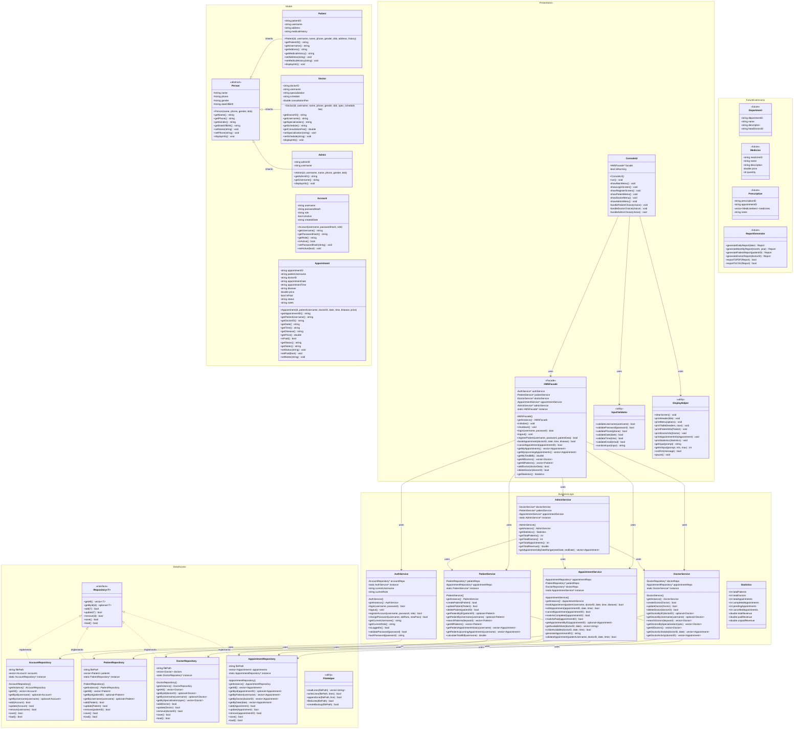

### Optimized Class Diagram

```mermaid
classDiagram
    direction TB

    %% ==================== MODEL LAYER (Entities) ====================
    namespace Model {
        class Person {
            <<abstract>>
            #string name
            #string phone
            #string gender
            #string dateOfBirth
            +Person(name, phone, gender, dob)
            +getName() string
            +getPhone() string
            +getGender() string
            +getDateOfBirth() string
            +setName(string) void
            +setPhone(string) void
            +displayInfo()* void
        }

        class Patient {
            -string patientID
            -string username
            -string address
            -string medicalHistory
            +Patient(id, username, name, phone, gender, dob, address, history)
            +getPatientID() string
            +getUsername() string
            +getAddress() string
            +getMedicalHistory() string
            +setAddress(string) void
            +setMedicalHistory(string) void
            +displayInfo() void
        }

        class Doctor {
            -string doctorID
            -string username
            -string specialization
            -string schedule
            -double consultationFee
            +Doctor(id, username, name, phone, gender, dob, spec, schedule, fee)
            +getDoctorID() string
            +getUsername() string
            +getSpecialization() string
            +getSchedule() string
            +getConsultationFee() double
            +setSpecialization(string) void
            +setSchedule(string) void
            +displayInfo() void
        }

        class Admin {
            -string adminID
            -string username
            +Admin(id, username, name, phone, gender, dob)
            +getAdminID() string
            +getUsername() string
            +displayInfo() void
        }

        class Account {
            -string username
            -string passwordHash
            -string role
            -bool isActive
            -string createdDate
            +Account(username, passwordHash, role)
            +getUsername() string
            +getPasswordHash() string
            +getRole() string
            +isActive() bool
            +setPasswordHash(string) void
            +setActive(bool) void
        }

        class Appointment {
            -string appointmentID
            -string patientUsername
            -string doctorID
            -string appointmentDate
            -string appointmentTime
            -string disease
            -double price
            -bool isPaid
            -string status
            -string notes
            +Appointment(id, patientUsername, doctorID, date, time, disease, price)
            +getAppointmentID() string
            +getPatientUsername() string
            +getDoctorID() string
            +getDate() string
            +getTime() string
            +getDisease() string
            +getPrice() double
            +isPaid() bool
            +getStatus() string
            +getNotes() string
            +setStatus(string) void
            +setPaid(bool) void
            +setNotes(string) void
        }
    }

    %% Inheritance
    Person <|-- Patient : inherits
    Person <|-- Doctor : inherits
    Person <|-- Admin : inherits

    %% ==================== DATA ACCESS LAYER (DAO/Repository) ====================
    namespace DataAccess {
        class IRepository~T~ {
            <<interface>>
            +getAll() vector~T~
            +getById(id) optional~T~
            +add(T) bool
            +update(T) bool
            +remove(id) bool
            +save() bool
            +load() bool
        }

        class AccountRepository {
            -string filePath
            -vector~Account~ accounts
            -static AccountRepository* instance
            -AccountRepository()
            +getInstance() AccountRepository*
            +getAll() vector~Account~
            +getById(username) optional~Account~
            +getByUsername(username) optional~Account~
            +add(Account) bool
            +update(Account) bool
            +remove(username) bool
            +save() bool
            +load() bool
        }

        class PatientRepository {
            -string filePath
            -vector~Patient~ patients
            -static PatientRepository* instance
            -PatientRepository()
            +getInstance() PatientRepository*
            +getAll() vector~Patient~
            +getById(patientID) optional~Patient~
            +getByUsername(username) optional~Patient~
            +add(Patient) bool
            +update(Patient) bool
            +remove(patientID) bool
            +save() bool
            +load() bool
        }

        class DoctorRepository {
            -string filePath
            -vector~Doctor~ doctors
            -static DoctorRepository* instance
            -DoctorRepository()
            +getInstance() DoctorRepository*
            +getAll() vector~Doctor~
            +getById(doctorID) optional~Doctor~
            +getByUsername(username) optional~Doctor~
            +getBySpecialization(spec) vector~Doctor~
            +add(Doctor) bool
            +update(Doctor) bool
            +remove(doctorID) bool
            +save() bool
            +load() bool
        }

        class AppointmentRepository {
            -string filePath
            -vector~Appointment~ appointments
            -static AppointmentRepository* instance
            -AppointmentRepository()
            +getInstance() AppointmentRepository*
            +getAll() vector~Appointment~
            +getById(appointmentID) optional~Appointment~
            +getByPatient(username) vector~Appointment~
            +getByDoctor(doctorID) vector~Appointment~
            +getByDate(date) vector~Appointment~
            +add(Appointment) bool
            +update(Appointment) bool
            +remove(appointmentID) bool
            +save() bool
            +load() bool
        }

        class FileHelper {
            <<utility>>
            +readLines(filePath) vector~string~
            +writeLines(filePath, lines) bool
            +appendLine(filePath, line) bool
            +fileExists(filePath) bool
            +createBackup(filePath) bool
        }
    }

    IRepository <|.. AccountRepository : implements
    IRepository <|.. PatientRepository : implements
    IRepository <|.. DoctorRepository : implements
    IRepository <|.. AppointmentRepository : implements

    %% ==================== BUSINESS LOGIC LAYER (Services) ====================
    namespace BusinessLogic {
        class AuthService {
            -AccountRepository* accountRepo
            -static AuthService* instance
            -string currentUsername
            -string currentRole
            -AuthService()
            +getInstance() AuthService*
            +login(username, password) bool
            +logout() void
            +registerAccount(username, password, role) bool
            +changePassword(username, oldPass, newPass) bool
            +getCurrentUsername() string
            +getCurrentRole() string
            +isLoggedIn() bool
            +validatePassword(password) bool
            -hashPassword(password) string
        }

        class PatientService {
            -PatientRepository* patientRepo
            -AppointmentRepository* appointmentRepo
            -static PatientService* instance
            -PatientService()
            +getInstance() PatientService*
            +createPatient(Patient) bool
            +updatePatient(Patient) bool
            +deletePatient(patientID) bool
            +getPatientByID(patientID) optional~Patient~
            +getPatientByUsername(username) optional~Patient~
            +searchPatients(keyword) vector~Patient~
            +getAllPatients() vector~Patient~
            +getPatientAppointmentHistory(username) vector~Appointment~
            +getPatientUpcomingAppointments(username) vector~Appointment~
            +calculateTotalBill(username) double
        }

        class DoctorService {
            -DoctorRepository* doctorRepo
            -AppointmentRepository* appointmentRepo
            -static DoctorService* instance
            -DoctorService()
            +getInstance() DoctorService*
            +createDoctor(Doctor) bool
            +updateDoctor(Doctor) bool
            +deleteDoctor(doctorID) bool
            +getDoctorByID(doctorID) optional~Doctor~
            +getDoctorByUsername(username) optional~Doctor~
            +searchDoctors(keyword) vector~Doctor~
            +getDoctorsBySpecialization(spec) vector~Doctor~
            +getAllDoctors() vector~Doctor~
            +getDoctorSchedule(doctorID, date) vector~Appointment~
            +getDoctorActivity(doctorID) vector~Appointment~
        }

        class AppointmentService {
            -AppointmentRepository* appointmentRepo
            -PatientRepository* patientRepo
            -DoctorRepository* doctorRepo
            -static AppointmentService* instance
            -AppointmentService()
            +getInstance() AppointmentService*
            +bookAppointment(patientUsername, doctorID, date, time, disease) bool
            +editAppointment(appointmentID, date, time) bool
            +cancelAppointment(appointmentID) bool
            +markAsCompleted(appointmentID) bool
            +markAsPaid(appointmentID) bool
            +getAppointmentByID(appointmentID) optional~Appointment~
            +getAvailableSlots(doctorID, date) vector~string~
            +isSlotAvailable(doctorID, date, time) bool
            -generateAppointmentID() string
            -validateAppointment(patientUsername, doctorID, date, time) bool
        }

        class AdminService {
            -DoctorService* doctorService
            -PatientService* patientService
            -AppointmentService* appointmentService
            -static AdminService* instance
            -AdminService()
            +getInstance() AdminService*
            +getStatistics() Statistics
            +getTotalPatients() int
            +getTotalDoctors() int
            +getTotalAppointments() int
            +getTotalRevenue() double
            +getAppointmentsByDateRange(startDate, endDate) vector~Appointment~
        }

        class Statistics {
            +int totalPatients
            +int totalDoctors
            +int totalAppointments
            +int completedAppointments
            +int pendingAppointments
            +int cancelledAppointments
            +double totalRevenue
            +double paidRevenue
            +double unpaidRevenue
        }
    }

    %% Service Dependencies
    AuthService --> AccountRepository : uses
    PatientService --> PatientRepository : uses
    PatientService --> AppointmentRepository : uses
    DoctorService --> DoctorRepository : uses
    DoctorService --> AppointmentRepository : uses
    AppointmentService --> AppointmentRepository : uses
    AppointmentService --> PatientRepository : uses
    AppointmentService --> DoctorRepository : uses
    AdminService --> DoctorService : uses
    AdminService --> PatientService : uses
    AdminService --> AppointmentService : uses

    %% ==================== PRESENTATION LAYER (UI/Controllers) ====================
    namespace Presentation {
        class HMSFacade {
            <<Facade>>
            -AuthService* authService
            -PatientService* patientService
            -DoctorService* doctorService
            -AppointmentService* appointmentService
            -AdminService* adminService
            -static HMSFacade* instance
            -HMSFacade()
            +getInstance() HMSFacade*
            +initialize() void
            +shutdown() void
            +login(username, password) bool
            +logout() void
            +registerPatient(username, password, patientData) bool
            +bookAppointment(doctorID, date, time, disease) bool
            +cancelAppointment(appointmentID) bool
            +getMyAppointments() vector~Appointment~
            +getMyUpcomingAppointments() vector~Appointment~
            +getMyTotalBill() double
            +getAllDoctors() vector~Doctor~
            +getAllPatients() vector~Patient~
            +addDoctor(doctorData) bool
            +deleteDoctor(doctorID) bool
            +getStatistics() Statistics
        }

        class ConsoleUI {
            -HMSFacade* facade
            -bool isRunning
            +ConsoleUI()
            +run() void
            -showMainMenu() void
            -showLoginScreen() void
            -showRegisterScreen() void
            -showPatientMenu() void
            -showDoctorMenu() void
            -showAdminMenu() void
            -handlePatientChoice(choice) void
            -handleDoctorChoice(choice) void
            -handleAdminChoice(choice) void
        }

        class InputValidator {
            <<utility>>
            +validateUsername(username) bool
            +validatePassword(password) bool
            +validatePhone(phone) bool
            +validateDate(date) bool
            +validateTime(time) bool
            +validateEmail(email) bool
            +sanitizeInput(input) string
        }

        class DisplayHelper {
            <<utility>>
            +clearScreen() void
            +printHeader(title) void
            +printMenu(options) void
            +printTable(headers, rows) void
            +printPatientInfo(Patient) void
            +printDoctorInfo(Doctor) void
            +printAppointmentInfo(Appointment) void
            +printStatistics(Statistics) void
            +getInput(prompt) string
            +getIntInput(prompt, min, max) int
            +confirm(message) bool
            +pause() void
        }
    }

    ConsoleUI --> HMSFacade : uses
    ConsoleUI --> InputValidator : uses
    ConsoleUI --> DisplayHelper : uses
    HMSFacade --> AuthService : uses
    HMSFacade --> PatientService : uses
    HMSFacade --> DoctorService : uses
    HMSFacade --> AppointmentService : uses
    HMSFacade --> AdminService : uses

    %% ==================== FUTURE EXTENSIONS (Planned) ====================
    namespace FutureExtensions {
        class Department {
            <<future>>
            -string departmentID
            -string name
            -string description
            -string headDoctorID
        }

        class Medicine {
            <<future>>
            -string medicineID
            -string name
            -string description
            -double price
            -int quantity
        }

        class Prescription {
            <<future>>
            -string prescriptionID
            -string appointmentID
            -vector~MedicineItem~ medicines
            -string notes
        }

        class ReportGenerator {
            <<future>>
            +generateDailyReport(date) Report
            +generateMonthlyReport(month, year) Report
            +generatePatientReport(patientID) Report
            +generateDoctorReport(doctorID) Report
            +exportToPDF(Report) bool
            +exportToCSV(Report) bool
        }
    }
```
