# Sơ Đồ Kiến Trúc Chi Tiết

> **Mục đích:** Hiểu đầy đủ relationships, dependencies, và class structure
> **Đối tượng:** Developers implementing code, architecture review

---

## 🔍 Sơ Đồ Dependencies Chi Tiết

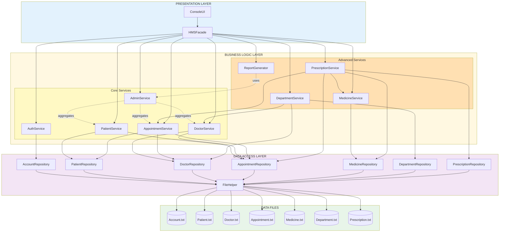
```mermaid
graph TB
    subgraph UI["PRESENTATION LAYER"]
        ConsoleUI[ConsoleUI]
        Facade[HMSFacade]
        ConsoleUI --> Facade
    end

    subgraph BLL["BUSINESS LOGIC LAYER"]
        direction LR

        subgraph CoreServices["Core Services"]
            AuthService[AuthService]
            PatientService[PatientService]
            DoctorService[DoctorService]
            AppointmentService[AppointmentService]
            AdminService[AdminService]
        end

        subgraph AdvancedServices["Advanced Services"]
            MedicineService[MedicineService]
            DepartmentService[DepartmentService]
            PrescriptionService[PrescriptionService]
            ReportGenerator[ReportGenerator]
        end

        AdminService -.aggregates.-> PatientService
        AdminService -.aggregates.-> DoctorService
        AdminService -.aggregates.-> AppointmentService

        DepartmentService --> DoctorService
        PrescriptionService --> AppointmentService
        PrescriptionService --> MedicineService
        ReportGenerator -.uses.-> AdminService
    end

    subgraph DAL["DATA ACCESS LAYER"]
        AccountRepo[AccountRepository]
        PatientRepo[PatientRepository]
        DoctorRepo[DoctorRepository]
        AppointmentRepo[AppointmentRepository]
        MedicineRepo[MedicineRepository]
        DepartmentRepo[DepartmentRepository]
        PrescriptionRepo[PrescriptionRepository]
        FileHelper[FileHelper]

        AccountRepo --> FileHelper
        PatientRepo --> FileHelper
        DoctorRepo --> FileHelper
        AppointmentRepo --> FileHelper
        MedicineRepo --> FileHelper
        DepartmentRepo --> FileHelper
        PrescriptionRepo --> FileHelper
    end

    subgraph Files["DATA FILES"]
        AccountTxt[(Account.txt)]
        PatientTxt[(Patient.txt)]
        DoctorTxt[(Doctor.txt)]
        AppointmentTxt[(Appointment.txt)]
        MedicineTxt[(Medicine.txt)]
        DepartmentTxt[(Department.txt)]
        PrescriptionTxt[(Prescription.txt)]
    end

    Facade --> AuthService
    Facade --> PatientService
    Facade --> DoctorService
    Facade --> AppointmentService
    Facade --> AdminService
    Facade --> MedicineService
    Facade --> DepartmentService
    Facade --> PrescriptionService
    Facade --> ReportGenerator

    AuthService --> AccountRepo
    PatientService --> PatientRepo
    PatientService --> AppointmentRepo
    DoctorService --> DoctorRepo
    DoctorService --> AppointmentRepo
    AppointmentService --> AppointmentRepo
    AppointmentService --> PatientRepo
    AppointmentService --> DoctorRepo
    MedicineService --> MedicineRepo
    DepartmentService --> DepartmentRepo
    DepartmentService --> DoctorRepo
    PrescriptionService --> PrescriptionRepo
    PrescriptionService --> AppointmentRepo
    PrescriptionService --> MedicineRepo

    FileHelper --> AccountTxt
    FileHelper --> PatientTxt
    FileHelper --> DoctorTxt
    FileHelper --> AppointmentTxt
    FileHelper --> MedicineTxt
    FileHelper --> DepartmentTxt
    FileHelper --> PrescriptionTxt

    style UI fill:#e3f2fd
    style BLL fill:#fff8e1
    style DAL fill:#f3e5f5
    style Files fill:#e8f5e9
    style CoreServices fill:#fff9c4
    style AdvancedServices fill:#ffe0b2
```

---

## 📋 Bảng Dependencies Chi Tiết

### Core Services → Repositories

| Service | Uses Repositories | Lý Do |
|---------|------------------|-------|
| **AuthService** | • AccountRepository | Login/logout<br>Quản lý account |
| **PatientService** | • PatientRepository<br>• AppointmentRepository | CRUD patients<br>Xem lịch hẹn, tính bills |
| **DoctorService** | • DoctorRepository<br>• AppointmentRepository | CRUD doctors<br>Xem lịch làm việc |
| **AppointmentService** | • AppointmentRepository<br>• PatientRepository<br>• DoctorRepository | CRUD appointments<br>Validate patient exists<br>Get doctor's consultation fee |
| **AdminService** | • PatientService<br>• DoctorService<br>• AppointmentService | Tổng hợp thống kê<br>Không trực tiếp dùng Repos |

### Advanced Services → Repositories

| Service | Uses Repositories | Lý Do |
|---------|------------------|-------|
| **MedicineService** | • MedicineRepository | Quản lý kho thuốc<br>Low stock alerts<br>Expiry tracking |
| **DepartmentService** | • DepartmentRepository<br>• DoctorRepository | Quản lý khoa/phòng ban<br>Assign doctors to departments |
| **PrescriptionService** | • PrescriptionRepository<br>• AppointmentRepository<br>• MedicineRepository | Tạo/quản lý đơn thuốc<br>Link với appointment<br>Validate medicine availability |
| **ReportGenerator** | • AdminService<br>• (via services) | Tạo báo cáo<br>Export sang nhiều formats |

### Repositories → Files

| Repository | File | Operations |
|-----------|------|-----------|
| AccountRepository | Account.txt | Read/Write accounts |
| PatientRepository | Patient.txt | Read/Write patients |
| DoctorRepository | Doctor.txt | Read/Write doctors |
| AppointmentRepository | Appointment.txt | Read/Write appointments |
| MedicineRepository | Medicine.txt | Read/Write medicines |
| DepartmentRepository | Department.txt | Read/Write departments |
| PrescriptionRepository | Prescription.txt | Read/Write prescriptions |

**Tất cả repositories đều sử dụng FileHelper cho I/O operations.**

---

## 🏗️ Class Diagrams - Model Layer

### Person (Abstract Base Class)

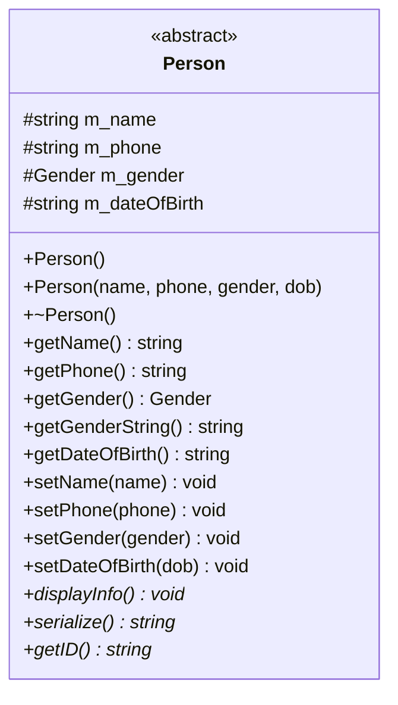
```mermaid
classDiagram
    class Person {
        <<abstract>>
        #string m_name
        #string m_phone
        #Gender m_gender
        #string m_dateOfBirth
        +Person()
        +Person(name, phone, gender, dob)
        +~Person()
        +getName() string
        +getPhone() string
        +getGender() Gender
        +getGenderString() string
        +getDateOfBirth() string
        +setName(name) void
        +setPhone(phone) void
        +setGender(gender) void
        +setDateOfBirth(dob) void
        +displayInfo()* void
        +serialize()* string
        +getID()* string
    }
```

### Patient

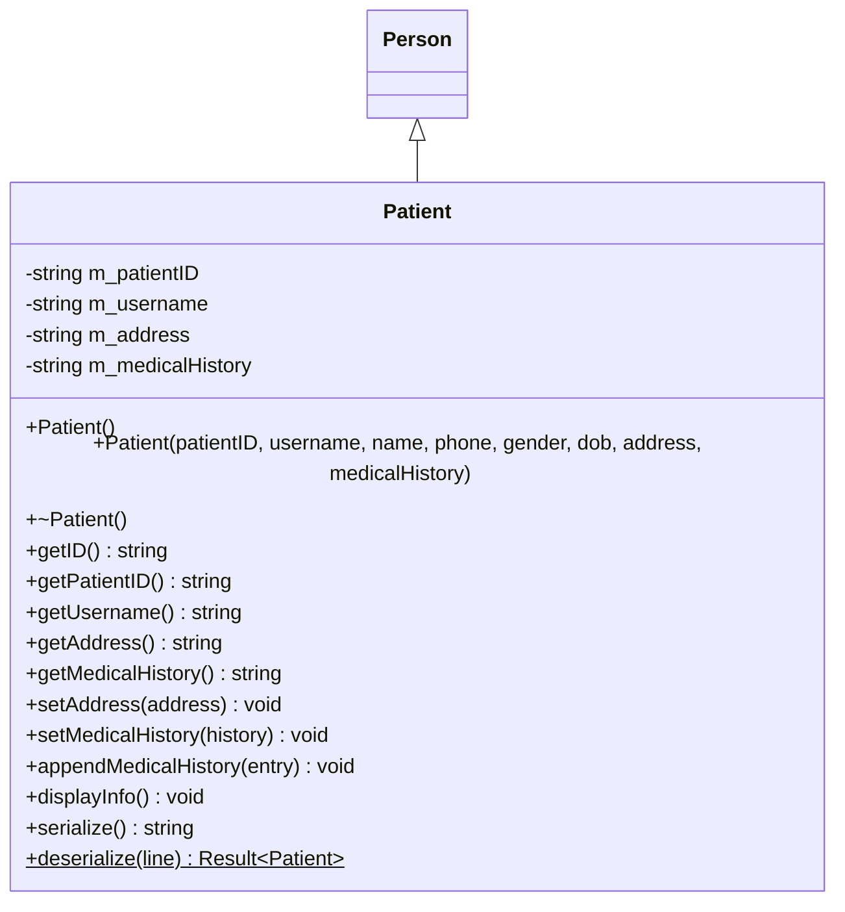
```mermaid
classDiagram
    class Patient {
        -string m_patientID
        -string m_username
        -string m_address
        -string m_medicalHistory
        +Patient()
        +Patient(patientID, username, name, phone, gender, dob, address, medicalHistory)
        +~Patient()
        +getID() string
        +getPatientID() string
        +getUsername() string
        +getAddress() string
        +getMedicalHistory() string
        +setAddress(address) void
        +setMedicalHistory(history) void
        +appendMedicalHistory(entry) void
        +displayInfo() void
        +serialize() string
        +deserialize(line)$ Result~Patient~
    }

    Person <|-- Patient
```

### Doctor

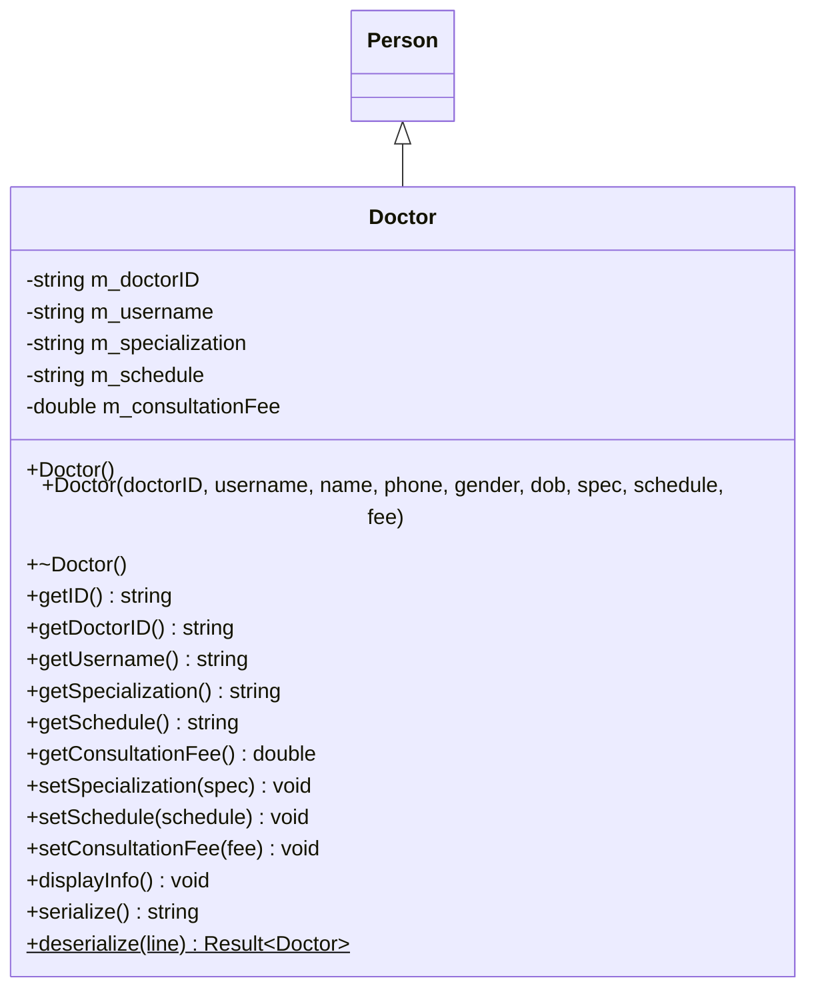
```mermaid
classDiagram
    class Doctor {
        -string m_doctorID
        -string m_username
        -string m_specialization
        -string m_schedule
        -double m_consultationFee
        +Doctor()
        +Doctor(doctorID, username, name, phone, gender, dob, spec, schedule, fee)
        +~Doctor()
        +getID() string
        +getDoctorID() string
        +getUsername() string
        +getSpecialization() string
        +getSchedule() string
        +getConsultationFee() double
        +setSpecialization(spec) void
        +setSchedule(schedule) void
        +setConsultationFee(fee) void
        +displayInfo() void
        +serialize() string
        +deserialize(line)$ Result~Doctor~
    }

    Person <|-- Doctor
```

### Admin

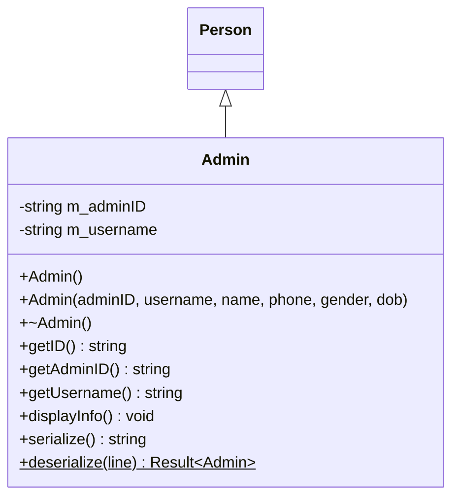
```mermaid
classDiagram
    class Admin {
        -string m_adminID
        -string m_username
        +Admin()
        +Admin(adminID, username, name, phone, gender, dob)
        +~Admin()
        +getID() string
        +getAdminID() string
        +getUsername() string
        +displayInfo() void
        +serialize() string
        +deserialize(line)$ Result~Admin~
    }

    Person <|-- Admin
```

### Account

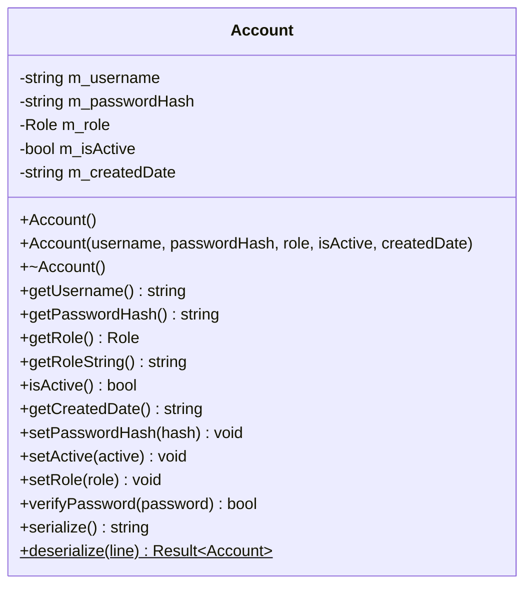
```mermaid
classDiagram
    class Account {
        -string m_username
        -string m_passwordHash
        -Role m_role
        -bool m_isActive
        -string m_createdDate
        +Account()
        +Account(username, passwordHash, role, isActive, createdDate)
        +~Account()
        +getUsername() string
        +getPasswordHash() string
        +getRole() Role
        +getRoleString() string
        +isActive() bool
        +getCreatedDate() string
        +setPasswordHash(hash) void
        +setActive(active) void
        +setRole(role) void
        +verifyPassword(password) bool
        +serialize() string
        +deserialize(line)$ Result~Account~
    }
```

### Appointment

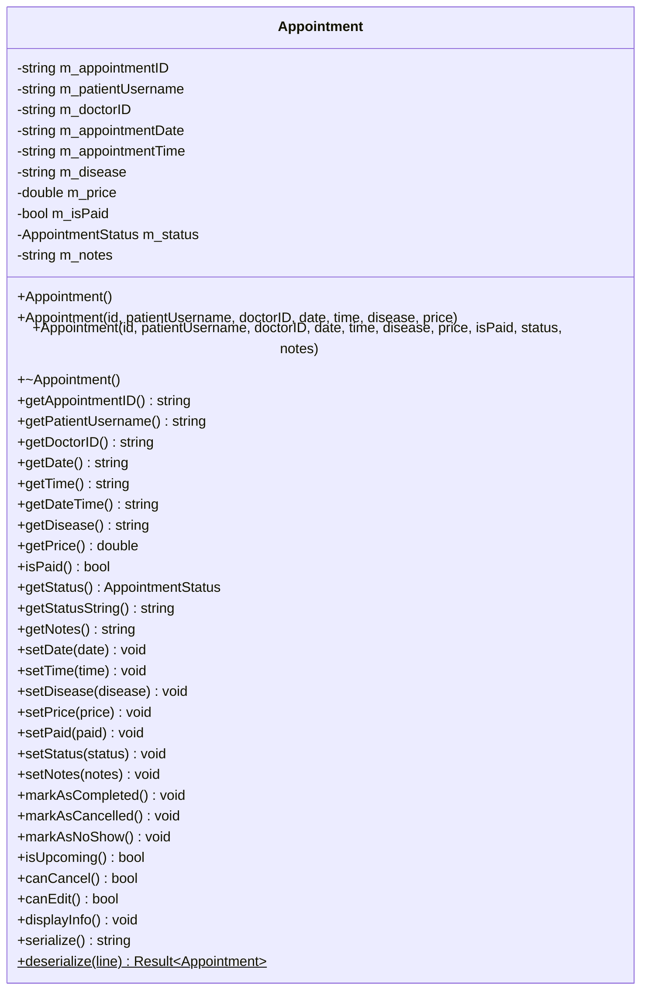
```mermaid
classDiagram
    class Appointment {
        -string m_appointmentID
        -string m_patientUsername
        -string m_doctorID
        -string m_appointmentDate
        -string m_appointmentTime
        -string m_disease
        -double m_price
        -bool m_isPaid
        -AppointmentStatus m_status
        -string m_notes
        +Appointment()
        +Appointment(id, patientUsername, doctorID, date, time, disease, price)
        +Appointment(id, patientUsername, doctorID, date, time, disease, price, isPaid, status, notes)
        +~Appointment()
        +getAppointmentID() string
        +getPatientUsername() string
        +getDoctorID() string
        +getDate() string
        +getTime() string
        +getDateTime() string
        +getDisease() string
        +getPrice() double
        +isPaid() bool
        +getStatus() AppointmentStatus
        +getStatusString() string
        +getNotes() string
        +setDate(date) void
        +setTime(time) void
        +setDisease(disease) void
        +setPrice(price) void
        +setPaid(paid) void
        +setStatus(status) void
        +setNotes(notes) void
        +markAsCompleted() void
        +markAsCancelled() void
        +markAsNoShow() void
        +isUpcoming() bool
        +canCancel() bool
        +canEdit() bool
        +displayInfo() void
        +serialize() string
        +deserialize(line)$ Result~Appointment~
    }
```

### Statistics

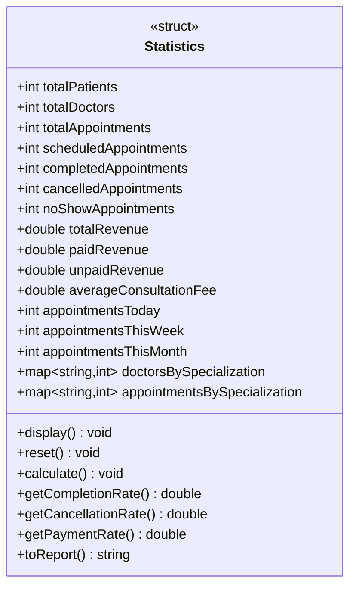
```mermaid
classDiagram
    class Statistics {
        <<struct>>
        +int totalPatients
        +int totalDoctors
        +int totalAppointments
        +int scheduledAppointments
        +int completedAppointments
        +int cancelledAppointments
        +int noShowAppointments
        +double totalRevenue
        +double paidRevenue
        +double unpaidRevenue
        +double averageConsultationFee
        +int appointmentsToday
        +int appointmentsThisWeek
        +int appointmentsThisMonth
        +map~string,int~ doctorsBySpecialization
        +map~string,int~ appointmentsBySpecialization
        +display() void
        +reset() void
        +calculate() void
        +getCompletionRate() double
        +getCancellationRate() double
        +getPaymentRate() double
        +toReport() string
    }
```

### Department

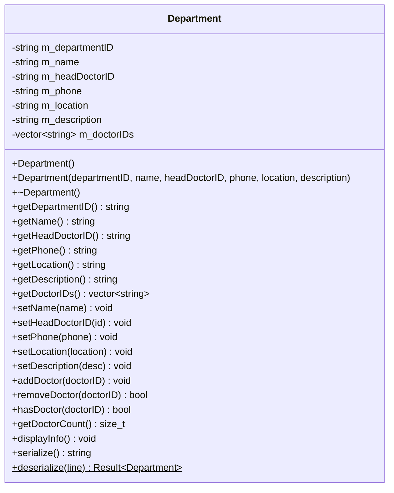
```mermaid
classDiagram
    class Department {
        -string m_departmentID
        -string m_name
        -string m_headDoctorID
        -string m_phone
        -string m_location
        -string m_description
        -vector~string~ m_doctorIDs
        +Department()
        +Department(departmentID, name, headDoctorID, phone, location, description)
        +~Department()
        +getDepartmentID() string
        +getName() string
        +getHeadDoctorID() string
        +getPhone() string
        +getLocation() string
        +getDescription() string
        +getDoctorIDs() vector~string~
        +setName(name) void
        +setHeadDoctorID(id) void
        +setPhone(phone) void
        +setLocation(location) void
        +setDescription(desc) void
        +addDoctor(doctorID) void
        +removeDoctor(doctorID) bool
        +hasDoctor(doctorID) bool
        +getDoctorCount() size_t
        +displayInfo() void
        +serialize() string
        +deserialize(line)$ Result~Department~
    }
```

### Medicine

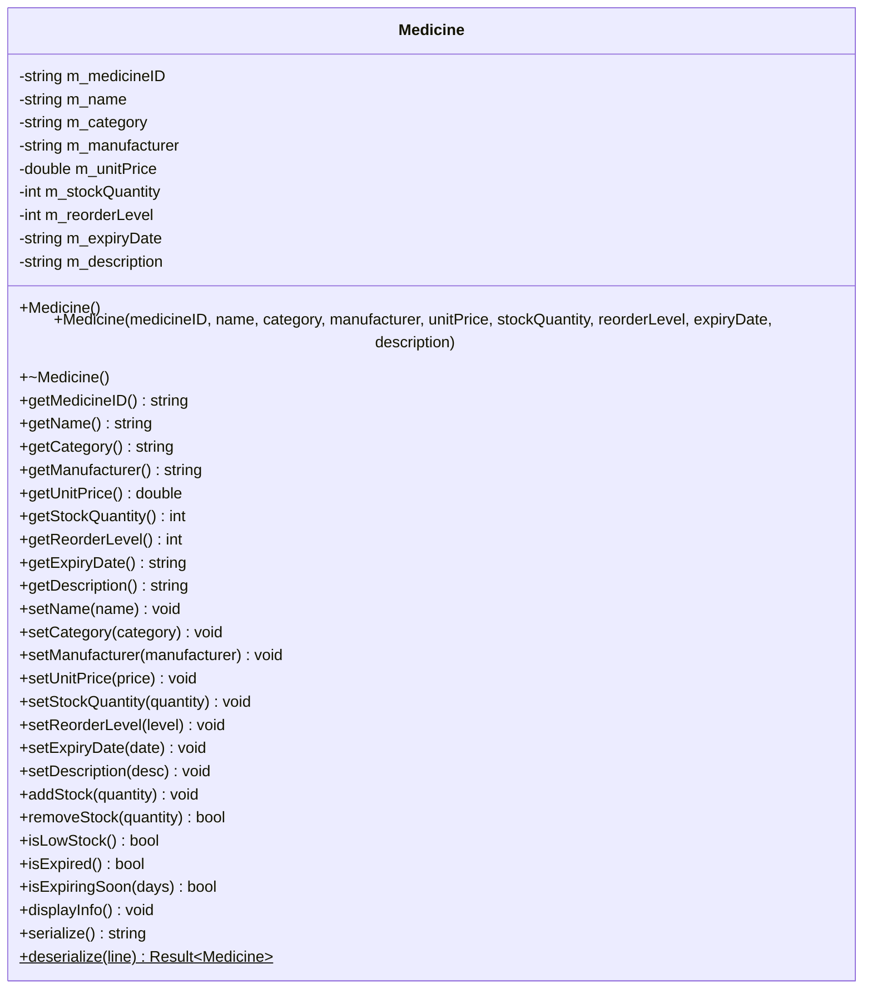
```mermaid
classDiagram
    class Medicine {
        -string m_medicineID
        -string m_name
        -string m_category
        -string m_manufacturer
        -double m_unitPrice
        -int m_stockQuantity
        -int m_reorderLevel
        -string m_expiryDate
        -string m_description
        +Medicine()
        +Medicine(medicineID, name, category, manufacturer, unitPrice, stockQuantity, reorderLevel, expiryDate, description)
        +~Medicine()
        +getMedicineID() string
        +getName() string
        +getCategory() string
        +getManufacturer() string
        +getUnitPrice() double
        +getStockQuantity() int
        +getReorderLevel() int
        +getExpiryDate() string
        +getDescription() string
        +setName(name) void
        +setCategory(category) void
        +setManufacturer(manufacturer) void
        +setUnitPrice(price) void
        +setStockQuantity(quantity) void
        +setReorderLevel(level) void
        +setExpiryDate(date) void
        +setDescription(desc) void
        +addStock(quantity) void
        +removeStock(quantity) bool
        +isLowStock() bool
        +isExpired() bool
        +isExpiringSoon(days) bool
        +displayInfo() void
        +serialize() string
        +deserialize(line)$ Result~Medicine~
    }
```

### Prescription & PrescriptionItem

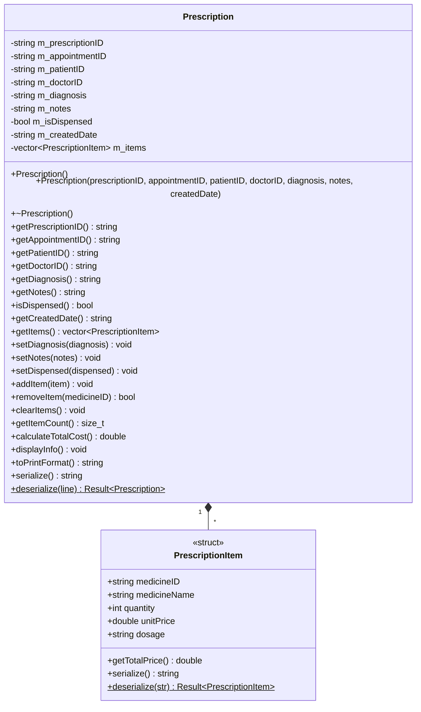
```mermaid
classDiagram
    class PrescriptionItem {
        <<struct>>
        +string medicineID
        +string medicineName
        +int quantity
        +double unitPrice
        +string dosage
        +getTotalPrice() double
        +serialize() string
        +deserialize(str)$ Result~PrescriptionItem~
    }

    class Prescription {
        -string m_prescriptionID
        -string m_appointmentID
        -string m_patientID
        -string m_doctorID
        -string m_diagnosis
        -string m_notes
        -bool m_isDispensed
        -string m_createdDate
        -vector~PrescriptionItem~ m_items
        +Prescription()
        +Prescription(prescriptionID, appointmentID, patientID, doctorID, diagnosis, notes, createdDate)
        +~Prescription()
        +getPrescriptionID() string
        +getAppointmentID() string
        +getPatientID() string
        +getDoctorID() string
        +getDiagnosis() string
        +getNotes() string
        +isDispensed() bool
        +getCreatedDate() string
        +getItems() vector~PrescriptionItem~
        +setDiagnosis(diagnosis) void
        +setNotes(notes) void
        +setDispensed(dispensed) void
        +addItem(item) void
        +removeItem(medicineID) bool
        +clearItems() void
        +getItemCount() size_t
        +calculateTotalCost() double
        +displayInfo() void
        +toPrintFormat() string
        +serialize() string
        +deserialize(line)$ Result~Prescription~
    }

    Prescription "1" *-- "*" PrescriptionItem
```

---

## 🏗️ Class Diagrams - Data Access Layer

### IRepository Interface

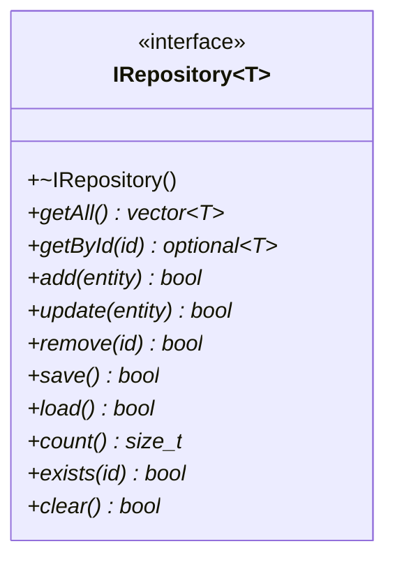
```mermaid
classDiagram
    class IRepository~T~ {
        <<interface>>
        +~IRepository()
        +getAll()* vector~T~
        +getById(id)* optional~T~
        +add(entity)* bool
        +update(entity)* bool
        +remove(id)* bool
        +save()* bool
        +load()* bool
        +count()* size_t
        +exists(id)* bool
        +clear()* bool
    }
```

### AccountRepository

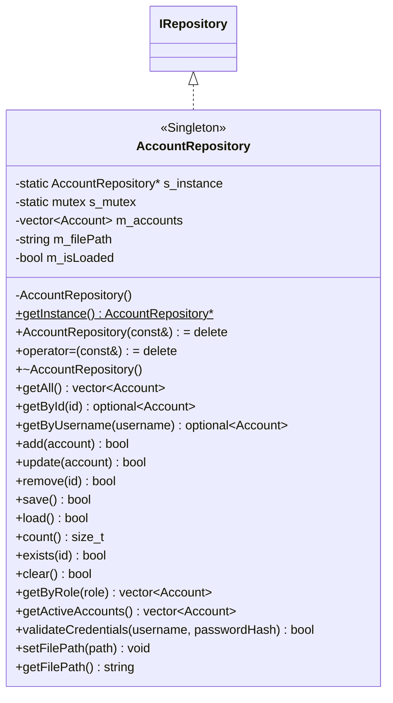
```mermaid
classDiagram
    class AccountRepository {
        <<Singleton>>
        -static AccountRepository* s_instance
        -static mutex s_mutex
        -vector~Account~ m_accounts
        -string m_filePath
        -bool m_isLoaded
        -AccountRepository()
        +getInstance()$ AccountRepository*
        +AccountRepository(const&) = delete
        +operator=(const&) = delete
        +~AccountRepository()
        +getAll() vector~Account~
        +getById(id) optional~Account~
        +getByUsername(username) optional~Account~
        +add(account) bool
        +update(account) bool
        +remove(id) bool
        +save() bool
        +load() bool
        +count() size_t
        +exists(id) bool
        +clear() bool
        +getByRole(role) vector~Account~
        +getActiveAccounts() vector~Account~
        +validateCredentials(username, passwordHash) bool
        +setFilePath(path) void
        +getFilePath() string
    }

    IRepository <|.. AccountRepository
```

### PatientRepository

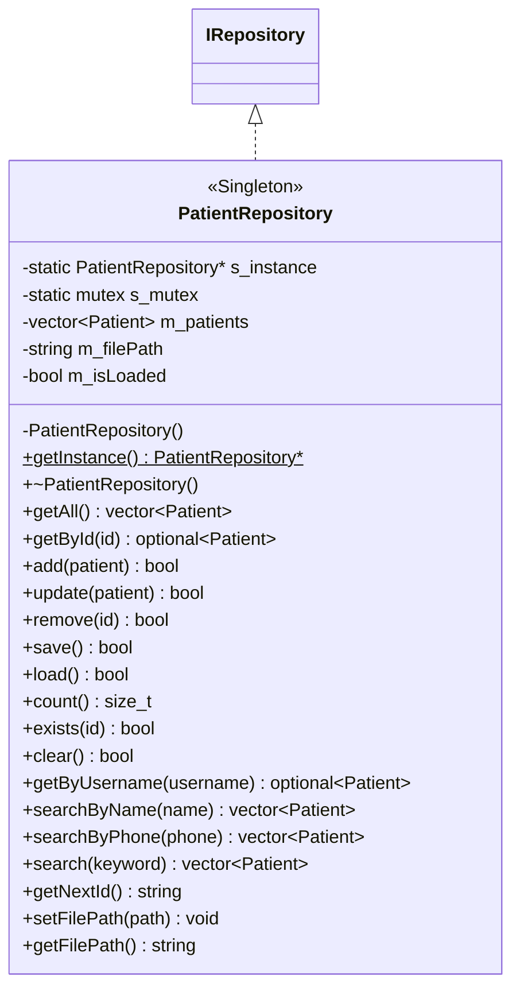
```mermaid
classDiagram
    class PatientRepository {
        <<Singleton>>
        -static PatientRepository* s_instance
        -static mutex s_mutex
        -vector~Patient~ m_patients
        -string m_filePath
        -bool m_isLoaded
        -PatientRepository()
        +getInstance()$ PatientRepository*
        +~PatientRepository()
        +getAll() vector~Patient~
        +getById(id) optional~Patient~
        +add(patient) bool
        +update(patient) bool
        +remove(id) bool
        +save() bool
        +load() bool
        +count() size_t
        +exists(id) bool
        +clear() bool
        +getByUsername(username) optional~Patient~
        +searchByName(name) vector~Patient~
        +searchByPhone(phone) vector~Patient~
        +search(keyword) vector~Patient~
        +getNextId() string
        +setFilePath(path) void
        +getFilePath() string
    }

    IRepository <|.. PatientRepository
```

### DoctorRepository

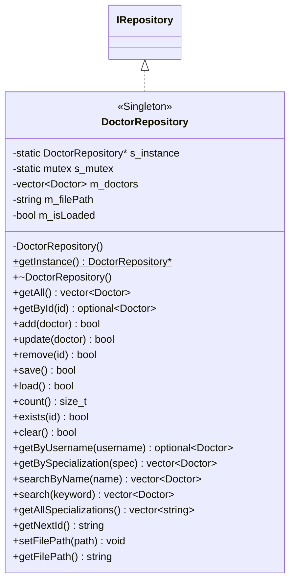
```mermaid
classDiagram
    class DoctorRepository {
        <<Singleton>>
        -static DoctorRepository* s_instance
        -static mutex s_mutex
        -vector~Doctor~ m_doctors
        -string m_filePath
        -bool m_isLoaded
        -DoctorRepository()
        +getInstance()$ DoctorRepository*
        +~DoctorRepository()
        +getAll() vector~Doctor~
        +getById(id) optional~Doctor~
        +add(doctor) bool
        +update(doctor) bool
        +remove(id) bool
        +save() bool
        +load() bool
        +count() size_t
        +exists(id) bool
        +clear() bool
        +getByUsername(username) optional~Doctor~
        +getBySpecialization(spec) vector~Doctor~
        +searchByName(name) vector~Doctor~
        +search(keyword) vector~Doctor~
        +getAllSpecializations() vector~string~
        +getNextId() string
        +setFilePath(path) void
        +getFilePath() string
    }

    IRepository <|.. DoctorRepository
```

### AppointmentRepository

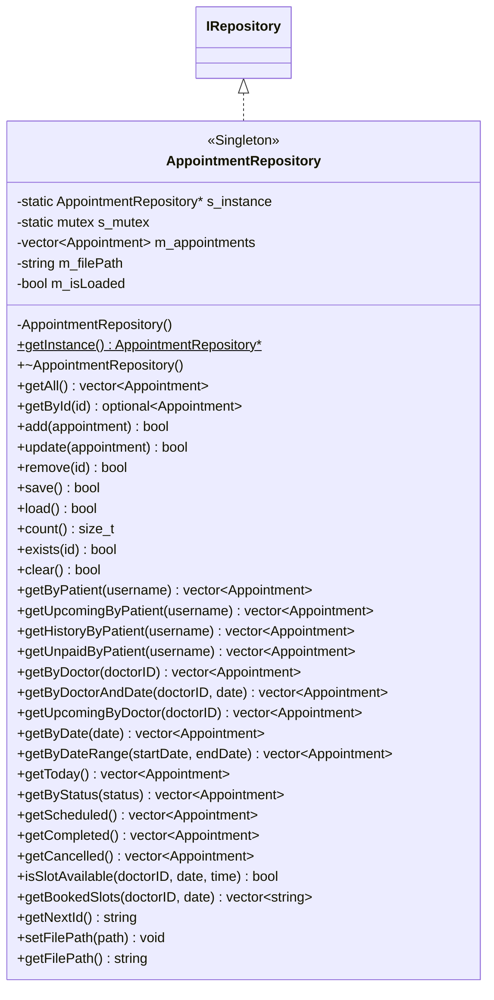
```mermaid
classDiagram
    class AppointmentRepository {
        <<Singleton>>
        -static AppointmentRepository* s_instance
        -static mutex s_mutex
        -vector~Appointment~ m_appointments
        -string m_filePath
        -bool m_isLoaded
        -AppointmentRepository()
        +getInstance()$ AppointmentRepository*
        +~AppointmentRepository()
        +getAll() vector~Appointment~
        +getById(id) optional~Appointment~
        +add(appointment) bool
        +update(appointment) bool
        +remove(id) bool
        +save() bool
        +load() bool
        +count() size_t
        +exists(id) bool
        +clear() bool
        +getByPatient(username) vector~Appointment~
        +getUpcomingByPatient(username) vector~Appointment~
        +getHistoryByPatient(username) vector~Appointment~
        +getUnpaidByPatient(username) vector~Appointment~
        +getByDoctor(doctorID) vector~Appointment~
        +getByDoctorAndDate(doctorID, date) vector~Appointment~
        +getUpcomingByDoctor(doctorID) vector~Appointment~
        +getByDate(date) vector~Appointment~
        +getByDateRange(startDate, endDate) vector~Appointment~
        +getToday() vector~Appointment~
        +getByStatus(status) vector~Appointment~
        +getScheduled() vector~Appointment~
        +getCompleted() vector~Appointment~
        +getCancelled() vector~Appointment~
        +isSlotAvailable(doctorID, date, time) bool
        +getBookedSlots(doctorID, date) vector~string~
        +getNextId() string
        +setFilePath(path) void
        +getFilePath() string
    }

    IRepository <|.. AppointmentRepository
```

### DepartmentRepository

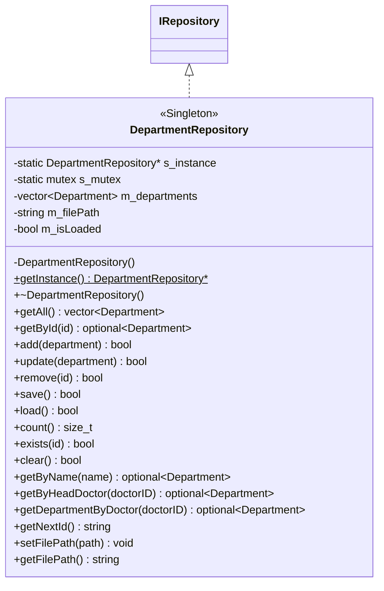
```mermaid
classDiagram
    class DepartmentRepository {
        <<Singleton>>
        -static DepartmentRepository* s_instance
        -static mutex s_mutex
        -vector~Department~ m_departments
        -string m_filePath
        -bool m_isLoaded
        -DepartmentRepository()
        +getInstance()$ DepartmentRepository*
        +~DepartmentRepository()
        +getAll() vector~Department~
        +getById(id) optional~Department~
        +add(department) bool
        +update(department) bool
        +remove(id) bool
        +save() bool
        +load() bool
        +count() size_t
        +exists(id) bool
        +clear() bool
        +getByName(name) optional~Department~
        +getByHeadDoctor(doctorID) optional~Department~
        +getDepartmentByDoctor(doctorID) optional~Department~
        +getNextId() string
        +setFilePath(path) void
        +getFilePath() string
    }

    IRepository <|.. DepartmentRepository
```

### MedicineRepository

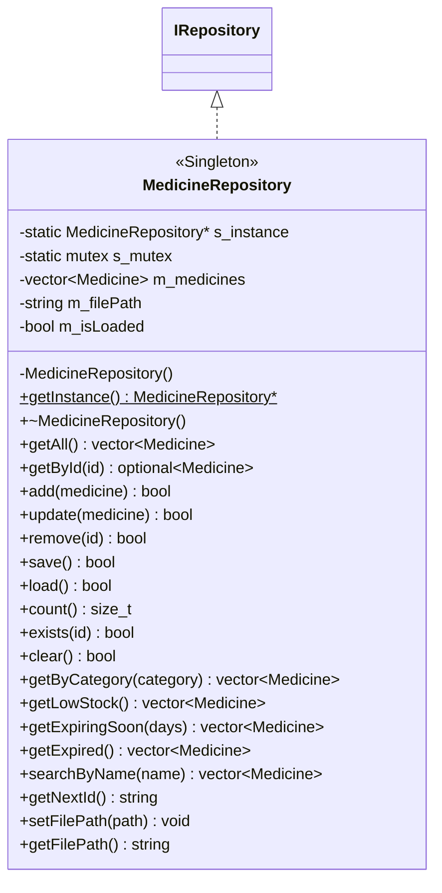
```mermaid
classDiagram
    class MedicineRepository {
        <<Singleton>>
        -static MedicineRepository* s_instance
        -static mutex s_mutex
        -vector~Medicine~ m_medicines
        -string m_filePath
        -bool m_isLoaded
        -MedicineRepository()
        +getInstance()$ MedicineRepository*
        +~MedicineRepository()
        +getAll() vector~Medicine~
        +getById(id) optional~Medicine~
        +add(medicine) bool
        +update(medicine) bool
        +remove(id) bool
        +save() bool
        +load() bool
        +count() size_t
        +exists(id) bool
        +clear() bool
        +getByCategory(category) vector~Medicine~
        +getLowStock() vector~Medicine~
        +getExpiringSoon(days) vector~Medicine~
        +getExpired() vector~Medicine~
        +searchByName(name) vector~Medicine~
        +getNextId() string
        +setFilePath(path) void
        +getFilePath() string
    }

    IRepository <|.. MedicineRepository
```

### PrescriptionRepository

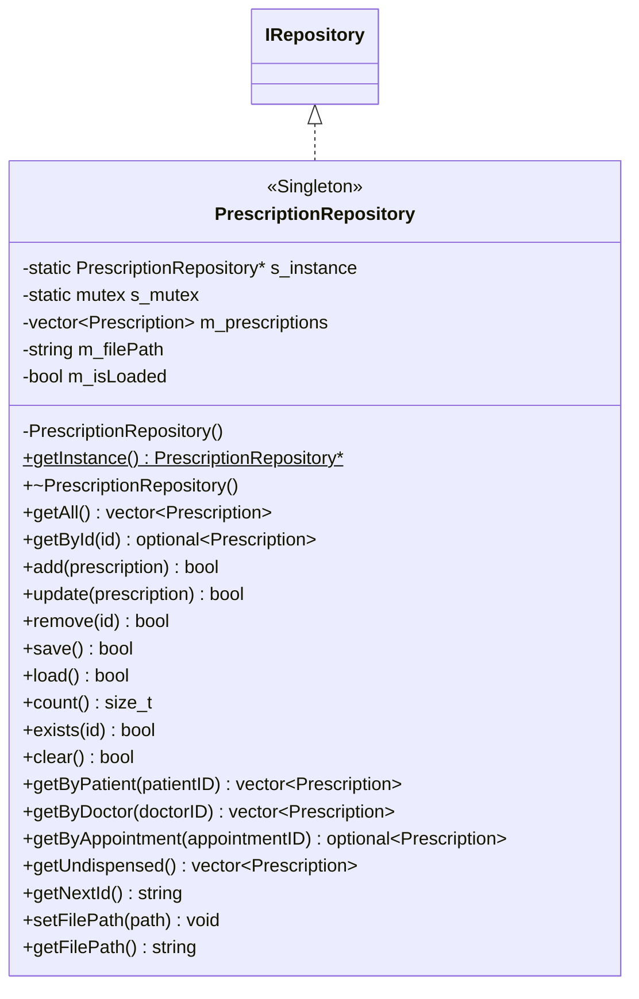
```mermaid
classDiagram
    class PrescriptionRepository {
        <<Singleton>>
        -static PrescriptionRepository* s_instance
        -static mutex s_mutex
        -vector~Prescription~ m_prescriptions
        -string m_filePath
        -bool m_isLoaded
        -PrescriptionRepository()
        +getInstance()$ PrescriptionRepository*
        +~PrescriptionRepository()
        +getAll() vector~Prescription~
        +getById(id) optional~Prescription~
        +add(prescription) bool
        +update(prescription) bool
        +remove(id) bool
        +save() bool
        +load() bool
        +count() size_t
        +exists(id) bool
        +clear() bool
        +getByPatient(patientID) vector~Prescription~
        +getByDoctor(doctorID) vector~Prescription~
        +getByAppointment(appointmentID) optional~Prescription~
        +getUndispensed() vector~Prescription~
        +getNextId() string
        +setFilePath(path) void
        +getFilePath() string
    }

    IRepository <|.. PrescriptionRepository
```

### FileHelper

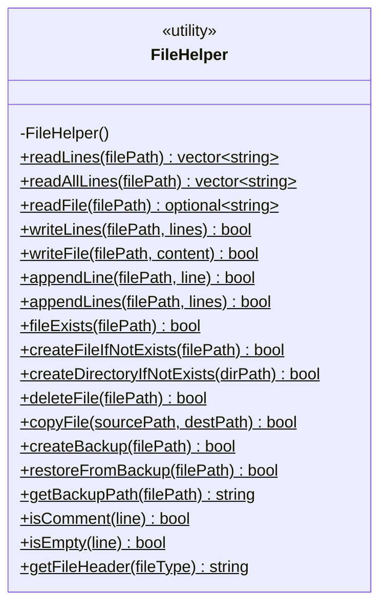
```mermaid
classDiagram
    class FileHelper {
        <<utility>>
        -FileHelper()
        +readLines(filePath)$ vector~string~
        +readAllLines(filePath)$ vector~string~
        +readFile(filePath)$ optional~string~
        +writeLines(filePath, lines)$ bool
        +writeFile(filePath, content)$ bool
        +appendLine(filePath, line)$ bool
        +appendLines(filePath, lines)$ bool
        +fileExists(filePath)$ bool
        +createFileIfNotExists(filePath)$ bool
        +createDirectoryIfNotExists(dirPath)$ bool
        +deleteFile(filePath)$ bool
        +copyFile(sourcePath, destPath)$ bool
        +createBackup(filePath)$ bool
        +restoreFromBackup(filePath)$ bool
        +getBackupPath(filePath)$ string
        +isComment(line)$ bool
        +isEmpty(line)$ bool
        +getFileHeader(fileType)$ string
    }
```

---

## 🏗️ Class Diagrams - Business Logic Layer

### AuthService

```mermaid
classDiagram
    class AuthService {
        <<Singleton>>
        -static AuthService* s_instance
        -static mutex s_mutex
        -AccountRepository* m_accountRepo
        -string m_currentUsername
        -Role m_currentRole
        -bool m_isLoggedIn
        -AuthService()
        +getInstance()$ AuthService*
        +~AuthService()
        +login(username, password) bool
        +logout() void
        +isLoggedIn() bool
        +getCurrentUsername() string
        +getCurrentRole() Role
        +getCurrentRoleString() string
        +getCurrentAccount() optional~Account~
        +registerAccount(username, password, role) bool
        +changePassword(oldPassword, newPassword) bool
        +resetPassword(username, newPassword) bool
        +deactivateAccount(username) bool
        +activateAccount(username) bool
        +isUsernameAvailable(username) bool
        +validatePassword(password) bool
        +validateUsername(username) bool
        +isPatient() bool
        +isDoctor() bool
        +isAdmin() bool
        +canPerformAdminActions() bool
        +saveData() bool
        +loadData() bool
        -hashPassword(password) string
        -verifyPassword(password, hash) bool
    }

    AuthService --> AccountRepository
```

### PatientService

```mermaid
classDiagram
    class PatientService {
        <<Singleton>>
        -static PatientService* s_instance
        -static mutex s_mutex
        -PatientRepository* m_patientRepo
        -AppointmentRepository* m_appointmentRepo
        -PatientService()
        +getInstance()$ PatientService*
        +~PatientService()
        +createPatient(patient) bool
        +createPatient(username, name, phone, gender, dob, address, history) optional~Patient~
        +updatePatient(patient) bool
        +deletePatient(patientID) bool
        +getPatientByID(patientID) optional~Patient~
        +getPatientByUsername(username) optional~Patient~
        +getAllPatients() vector~Patient~
        +searchPatients(keyword) vector~Patient~
        +getPatientCount() size_t
        +getAppointmentHistory(username) vector~Appointment~
        +getUpcomingAppointments(username) vector~Appointment~
        +getPastAppointments(username) vector~Appointment~
        +calculateTotalBill(username) double
        +calculateTotalPaid(username) double
        +getUnpaidAppointments(username) vector~Appointment~
        +updateMedicalHistory(patientID, newHistory) bool
        +appendMedicalHistory(patientID, entry) bool
        +validatePatient(patient) bool
        +patientExists(patientID) bool
        +saveData() bool
        +loadData() bool
    }

    PatientService --> PatientRepository
    PatientService --> AppointmentRepository
```

### DoctorService

```mermaid
classDiagram
    class DoctorService {
        <<Singleton>>
        -static DoctorService* s_instance
        -static mutex s_mutex
        -DoctorRepository* m_doctorRepo
        -AppointmentRepository* m_appointmentRepo
        -DoctorService()
        +getInstance()$ DoctorService*
        +~DoctorService()
        +createDoctor(doctor) bool
        +createDoctor(username, name, phone, gender, dob, spec, schedule, fee) optional~Doctor~
        +updateDoctor(doctor) bool
        +deleteDoctor(doctorID) bool
        +getDoctorByID(doctorID) optional~Doctor~
        +getDoctorByUsername(username) optional~Doctor~
        +getAllDoctors() vector~Doctor~
        +searchDoctors(keyword) vector~Doctor~
        +getDoctorsBySpecialization(spec) vector~Doctor~
        +getAllSpecializations() vector~string~
        +getDoctorCount() size_t
        +getDoctorSchedule(doctorID, date) vector~Appointment~
        +getUpcomingAppointments(doctorID) vector~Appointment~
        +getAvailableSlots(doctorID, date) vector~string~
        +isSlotAvailable(doctorID, date, time) bool
        +getDoctorActivity(doctorID) vector~Appointment~
        +getCompletedAppointments(doctorID) vector~Appointment~
        +getAppointmentsInRange(doctorID, startDate, endDate) vector~Appointment~
        +getTodayAppointments(doctorID) vector~Appointment~
        +getDoctorRevenue(doctorID) double
        +getDoctorAppointmentCount(doctorID) size_t
        +getDoctorPatientCount(doctorID) size_t
        +validateDoctor(doctor) bool
        +doctorExists(doctorID) bool
        +saveData() bool
        +loadData() bool
    }

    DoctorService --> DoctorRepository
    DoctorService --> AppointmentRepository
```

### AppointmentService

```mermaid
classDiagram
    class AppointmentService {
        <<Singleton>>
        -static AppointmentService* s_instance
        -static mutex s_mutex
        -AppointmentRepository* m_appointmentRepo
        -PatientRepository* m_patientRepo
        -DoctorRepository* m_doctorRepo
        -AppointmentService()
        +getInstance()$ AppointmentService*
        +~AppointmentService()
        +bookAppointment(patientUsername, doctorID, date, time, disease) optional~Appointment~
        +editAppointment(appointmentID, newDate, newTime) bool
        +cancelAppointment(appointmentID) bool
        +rescheduleAppointment(appointmentID, newDate, newTime) bool
        +markAsCompleted(appointmentID) bool
        +markAsNoShow(appointmentID) bool
        +markAsPaid(appointmentID) bool
        +updateNotes(appointmentID, notes) bool
        +getAppointmentByID(appointmentID) optional~Appointment~
        +getAllAppointments() vector~Appointment~
        +getAppointmentsByStatus(status) vector~Appointment~
        +getAppointmentsByDate(date) vector~Appointment~
        +getAppointmentsInRange(startDate, endDate) vector~Appointment~
        +getTodayAppointments() vector~Appointment~
        +getAppointmentCount() size_t
        +getAvailableSlots(doctorID, date) vector~string~
        +isSlotAvailable(doctorID, date, time) bool
        +getStandardTimeSlots() vector~string~
        +validateBooking(patientUsername, doctorID, date, time) bool
        +canCancel(appointmentID) bool
        +canEdit(appointmentID) bool
        +getTotalRevenue() double
        +getPaidRevenue() double
        +getUnpaidRevenue() double
        +getCountByStatus(status) size_t
        +saveData() bool
        +loadData() bool
        -generateAppointmentID() string
        -getDoctorFee(doctorID) double
        -patientExists(patientUsername) bool
        -doctorExists(doctorID) bool
    }

    AppointmentService --> AppointmentRepository
    AppointmentService --> PatientRepository
    AppointmentService --> DoctorRepository
```

### AdminService

```mermaid
classDiagram
    class AdminService {
        <<Singleton>>
        -static AdminService* s_instance
        -static mutex s_mutex
        -PatientService* m_patientService
        -DoctorService* m_doctorService
        -AppointmentService* m_appointmentService
        -AdminService()
        +getInstance()$ AdminService*
        +~AdminService()
        +getStatistics() Statistics
        +getTotalPatients() int
        +getTotalDoctors() int
        +getTotalAppointments() int
        +getTotalRevenue() double
        +getPaidRevenue() double
        +getUnpaidRevenue() double
        +getScheduledAppointmentsCount() int
        +getCompletedAppointmentsCount() int
        +getCancelledAppointmentsCount() int
        +getNoShowAppointmentsCount() int
        +getAppointmentsToday() vector~Appointment~
        +getAppointmentsThisWeek() vector~Appointment~
        +getAppointmentsThisMonth() vector~Appointment~
        +getAppointmentsByDateRange(startDate, endDate) vector~Appointment~
        +getDoctorsByActivity() vector~Doctor~
        +getDoctorsByRevenue() vector~Doctor~
        +getDoctorCountBySpecialization() map~string,int~
        +getAppointmentCountBySpecialization() map~string,int~
        +generateDailyReport(date) string
        +generateWeeklyReport(startDate) string
        +generateMonthlyReport(month, year) string
        +generateSummaryReport() string
        +saveAllData() bool
        +loadAllData() bool
        +createBackup() bool
        +restoreFromBackup() bool
        +checkSystemHealth() bool
        +getSystemStatus() string
    }

    AdminService --> PatientService
    AdminService --> DoctorService
    AdminService --> AppointmentService
    AdminService ..> Statistics
```

### MedicineService

```mermaid
classDiagram
    class MedicineService {
        <<Singleton>>
        -static MedicineService* s_instance
        -static mutex s_mutex
        -MedicineRepository* m_medicineRepo
        -MedicineService()
        +getInstance()$ MedicineService*
        +~MedicineService()
        +createMedicine(name, category, manufacturer, price, quantity, reorderLevel, expiryDate, description) optional~Medicine~
        +updateMedicine(medicine) bool
        +deleteMedicine(medicineID) bool
        +getMedicineByID(medicineID) optional~Medicine~
        +getAllMedicines() vector~Medicine~
        +searchMedicines(keyword) vector~Medicine~
        +getByCategory(category) vector~Medicine~
        +getMedicineCount() size_t
        +addStock(medicineID, quantity) bool
        +removeStock(medicineID, quantity) bool
        +transferStock(fromMedicineID, toMedicineID, quantity) bool
        +getLowStockAlerts() vector~Medicine~
        +getExpiryAlerts(days) vector~Medicine~
        +getExpiredMedicines() vector~Medicine~
        +validateMedicine(medicine) bool
        +medicineExists(medicineID) bool
        +saveData() bool
        +loadData() bool
    }

    MedicineService --> MedicineRepository
```

### DepartmentService

```mermaid
classDiagram
    class DepartmentService {
        <<Singleton>>
        -static DepartmentService* s_instance
        -static mutex s_mutex
        -DepartmentRepository* m_departmentRepo
        -DoctorRepository* m_doctorRepo
        -DepartmentService()
        +getInstance()$ DepartmentService*
        +~DepartmentService()
        +createDepartment(name, headDoctorID, phone, location, description) optional~Department~
        +updateDepartment(department) bool
        +deleteDepartment(departmentID) bool
        +getDepartmentByID(departmentID) optional~Department~
        +getAllDepartments() vector~Department~
        +searchDepartments(keyword) vector~Department~
        +getDepartmentCount() size_t
        +assignDoctor(departmentID, doctorID) bool
        +unassignDoctor(departmentID, doctorID) bool
        +setDepartmentHead(departmentID, doctorID) bool
        +getDepartmentByDoctor(doctorID) optional~Department~
        +getDepartmentStats(departmentID) map~string,int~
        +validateDepartment(department) bool
        +departmentExists(departmentID) bool
        +saveData() bool
        +loadData() bool
    }

    DepartmentService --> DepartmentRepository
    DepartmentService --> DoctorRepository
```

### PrescriptionService

```mermaid
classDiagram
    class PrescriptionService {
        <<Singleton>>
        -static PrescriptionService* s_instance
        -static mutex s_mutex
        -PrescriptionRepository* m_prescriptionRepo
        -AppointmentRepository* m_appointmentRepo
        -MedicineRepository* m_medicineRepo
        -PrescriptionService()
        +getInstance()$ PrescriptionService*
        +~PrescriptionService()
        +createPrescription(appointmentID, diagnosis, notes) optional~Prescription~
        +updatePrescription(prescription) bool
        +deletePrescription(prescriptionID) bool
        +getPrescriptionByID(prescriptionID) optional~Prescription~
        +getByAppointment(appointmentID) optional~Prescription~
        +getAllPrescriptions() vector~Prescription~
        +getPrescriptionCount() size_t
        +addPrescriptionItem(prescriptionID, medicineID, quantity, dosage) bool
        +removePrescriptionItem(prescriptionID, medicineID) bool
        +dispensePrescription(prescriptionID) bool
        +getPatientPrescriptions(patientID) vector~Prescription~
        +getDoctorPrescriptions(doctorID) vector~Prescription~
        +getUndispensedPrescriptions() vector~Prescription~
        +printPrescription(prescriptionID) string
        +validatePrescription(prescription) bool
        +prescriptionExists(prescriptionID) bool
        +saveData() bool
        +loadData() bool
    }

    PrescriptionService --> PrescriptionRepository
    PrescriptionService --> AppointmentRepository
    PrescriptionService --> MedicineRepository
```

### ReportGenerator

```mermaid
classDiagram
    class ReportGenerator {
        <<Singleton>>
        -static ReportGenerator* s_instance
        -static mutex s_mutex
        -AppointmentService* m_appointmentService
        -PatientService* m_patientService
        -DoctorService* m_doctorService
        -MedicineService* m_medicineService
        -ReportGenerator()
        +getInstance()$ ReportGenerator*
        +~ReportGenerator()
        +generateDailyReport(date) string
        +generateWeeklyReport(startDate) string
        +generateMonthlyReport(month, year) string
        +generateRevenueReport(startDate, endDate) string
        +generatePatientReport() string
        +generateDoctorPerformanceReport() string
        +generateAppointmentAnalysis() string
        +generateMedicineReport() string
        +generatePrescriptionReport() string
        +exportToText(report, filename) bool
        +exportToCSV(report, filename) bool
        +exportToHTML(report, filename) bool
        +exportReport(report, filename, format) bool
        +displayReport(report) void
    }

    ReportGenerator --> AppointmentService
    ReportGenerator --> PatientService
    ReportGenerator --> DoctorService
    ReportGenerator --> MedicineService
```

---

## 🏗️ Class Diagrams - Presentation Layer

### HMSFacade

```mermaid
classDiagram
    class HMSFacade {
        <<Singleton, Facade>>
        -static HMSFacade* s_instance
        -static mutex s_mutex
        -AuthService* m_authService
        -PatientService* m_patientService
        -DoctorService* m_doctorService
        -AppointmentService* m_appointmentService
        -AdminService* m_adminService
        -bool m_isInitialized
        -HMSFacade()
        +getInstance()$ HMSFacade*
        +~HMSFacade()
        +initialize() bool
        +shutdown() void
        +isInitialized() bool
        +login(username, password) bool
        +logout() void
        +isLoggedIn() bool
        +getCurrentUsername() string
        +getCurrentRole() Role
        +registerPatient(username, password, name, phone, gender, dob, address) bool
        +isUsernameAvailable(username) bool
        +getMyProfile() optional~Patient~
        +updateMyProfile(phone, address) bool
        +getMyAppointments() vector~Appointment~
        +getMyUpcomingAppointments() vector~Appointment~
        +getMyTotalBill() double
        +bookAppointment(doctorID, date, time, disease) bool
        +cancelAppointment(appointmentID) bool
        +getAllDoctors() vector~Doctor~
        +getDoctorsBySpecialization(spec) vector~Doctor~
        +getAllSpecializations() vector~string~
        +getDoctorByID(doctorID) optional~Doctor~
        +getAvailableSlots(doctorID, date) vector~string~
        +getAllPatients() vector~Patient~
        +searchPatients(keyword) vector~Patient~
        +getPatientByID(patientID) optional~Patient~
        +addPatient(name, phone, gender, dob, address, history) bool
        +updatePatient(patientID, phone, address, history) bool
        +deletePatient(patientID) bool
        +getMySchedule(date) vector~Appointment~
        +markAppointmentCompleted(appointmentID) bool
        +addDoctor(username, password, name, phone, gender, dob, spec, schedule, fee) bool
        +updateDoctor(doctorID, spec, schedule, fee) bool
        +deleteDoctor(doctorID) bool
        +getStatistics() Statistics
        +generateReport() string
        +saveData() bool
        +loadData() bool
    }

    HMSFacade --> AuthService
    HMSFacade --> PatientService
    HMSFacade --> DoctorService
    HMSFacade --> AppointmentService
    HMSFacade --> AdminService
```

### ConsoleUI

```mermaid
classDiagram
    class ConsoleUI {
        -HMSFacade* m_facade
        -bool m_isRunning
        +ConsoleUI()
        +~ConsoleUI()
        +run() void
        +stop() void
        -showMainMenu() void
        -showLoginScreen() void
        -showRegisterScreen() void
        -showPatientMenu() void
        -showDoctorMenu() void
        -showAdminMenu() void
        -handleMainMenuChoice(choice) void
        -handlePatientChoice(choice) void
        -handleDoctorChoice(choice) void
        -handleAdminChoice(choice) void
        -bookAppointment() void
        -viewAppointments() void
        -viewUpcomingAppointments() void
        -cancelAppointment() void
        -viewTotalBill() void
        -viewMyProfile() void
        -addPatient() void
        -searchPatient() void
        -editPatient() void
        -deletePatient() void
        -listAllPatients() void
        -viewDoctorSchedule() void
        -markAppointmentComplete() void
        -addDoctor() void
        -searchDoctor() void
        -editDoctor() void
        -deleteDoctor() void
        -listAllDoctors() void
        -viewStatistics() void
        -viewReports() void
        -selectDoctor() string
        -selectPatient() string
        -selectAppointment(appointments) string
        -selectDate() string
        -selectTimeSlot(slots) string
        -routeToRoleMenu() void
        -performLogout() void
    }

    ConsoleUI --> HMSFacade
    ConsoleUI ..> InputValidator
    ConsoleUI ..> DisplayHelper
```

### InputValidator

```mermaid
classDiagram
    class InputValidator {
        <<utility>>
        -InputValidator()
        +validateUsername(username)$ bool
        +getUsernameError(username)$ string
        +validatePassword(password)$ bool
        +getPasswordError(password)$ string
        +getPasswordStrength(password)$ int
        +validatePhone(phone)$ bool
        +getPhoneError(phone)$ string
        +validateDate(date)$ bool
        +validateFutureDate(date)$ bool
        +validatePastDate(date)$ bool
        +getDateError(date)$ string
        +validateTime(time)$ bool
        +validateWorkingHours(time)$ bool
        +getTimeError(time)$ string
        +validateName(name)$ bool
        +getNameError(name)$ string
        +validateGender(gender)$ bool
        +normalizeGender(gender)$ string
        +validateMoney(amount)$ bool
        +parseMoney(amount)$ double
        +validatePatientID(id)$ bool
        +validateDoctorID(id)$ bool
        +validateAppointmentID(id)$ bool
        +validateMenuChoice(choice, min, max)$ bool
        +parseMenuChoice(choice)$ int
        +isEmpty(str)$ bool
        +isNumeric(str)$ bool
        +isAlphabetic(str)$ bool
        +sanitizeInput(input)$ string
        +isYesConfirmation(input)$ bool
    }
```

### DisplayHelper

```mermaid
classDiagram
    class DisplayHelper {
        <<utility>>
        -DisplayHelper()
        -RESET$ const char*
        -RED$ const char*
        -GREEN$ const char*
        -YELLOW$ const char*
        -BLUE$ const char*
        -CYAN$ const char*
        -BOLD$ const char*
        +clearScreen()$ void
        +pause()$ void
        +pause(message)$ void
        +printAppHeader()$ void
        +printHeader(title)$ void
        +printSubHeader(title)$ void
        +printSeparator(width, ch)$ void
        +printThinSeparator(width)$ void
        +printMenu(title, options)$ void
        +printMainMenu()$ void
        +printPatientMenu(username)$ void
        +printDoctorMenu(username)$ void
        +printAdminMenu(username)$ void
        +getInput(prompt)$ string
        +getIntInput(prompt, min, max)$ int
        +getDoubleInput(prompt)$ double
        +confirm(message)$ bool
        +getPasswordInput(prompt)$ string
        +printPatientInfo(patient)$ void
        +printDoctorInfo(doctor)$ void
        +printAppointmentInfo(appointment)$ void
        +printStatistics(stats)$ void
        +printTable(headers, rows, colWidths)$ void
        +printPatientTable(patients)$ void
        +printDoctorTable(doctors)$ void
        +printAppointmentTable(appointments)$ void
        +printPatientList(patients)$ void
        +printDoctorList(doctors)$ void
        +printAppointmentList(appointments)$ void
        +printTimeSlotList(slots)$ void
        +printSuccess(message)$ void
        +printError(message)$ void
        +printWarning(message)$ void
        +printInfo(message)$ void
        +printNoData(entityType)$ void
        +formatMoney(amount)$ string
        +formatDate(date)$ string
        +formatStatus(status)$ string
        +truncate(str, maxLength)$ string
        +pad(str, width, leftAlign)$ string
    }
```

---

## 🔄 Use Case: Book Appointment

### Flow Chi Tiết

```
1. User input → ConsoleUI.bookAppointment()
   ↓
2. ConsoleUI → selectDoctor() [show doctor list]
   ↓
3. ConsoleUI → selectDate() [get date from user]
   ↓
4. ConsoleUI → facade->getAvailableSlots(doctorID, date)
   ↓
5. Facade → appointmentService->getAvailableSlots(...)
   ↓
6. ConsoleUI → selectTimeSlot(slots) [show available slots]
   ↓
7. ConsoleUI → get disease description from user
   ↓
8. ConsoleUI → facade->bookAppointment(doctorID, date, time, disease)
   ↓
9. Facade → appointmentService->bookAppointment(currentUsername, ...)
   ↓
10. AppointmentService:
    10.1. Validate patient → patientRepo->getByUsername(patientUsername)
    10.2. Validate doctor → doctorRepo->getById(doctorID)
    10.3. Get fee → doctor.getConsultationFee()
    10.4. Check slot → isSlotAvailable(doctorID, date, time)
    10.5. Generate ID → generateAppointmentID()
    10.6. Create appointment → appointmentRepo->add(appointment)
    10.7. Save to file → appointmentRepo->save()
    ↓
11. Facade → return success/failure
    ↓
12. ConsoleUI → DisplayHelper.printSuccess("Đặt lịch thành công!")
```

---

## 📊 Method Responsibilities

### AppointmentService Methods

| Method | Uses Repositories | Purpose |
|--------|------------------|---------|
| `bookAppointment()` | PatientRepo, DoctorRepo, AppointmentRepo | Validate và tạo appointment mới |
| `isSlotAvailable()` | AppointmentRepo | Check xem time slot còn trống không |
| `cancelAppointment()` | AppointmentRepo | Cập nhật status thành "cancelled" |
| `markAsCompleted()` | AppointmentRepo | Cập nhật status thành "completed" |
| `markAsPaid()` | AppointmentRepo | Cập nhật isPaid = true |
| `rescheduleAppointment()` | AppointmentRepo | Đổi date/time của appointment |
| `getAvailableSlots()` | AppointmentRepo | Lấy danh sách slots còn trống |

### PatientService Methods

| Method | Uses Repositories | Purpose |
|--------|------------------|---------|
| `createPatient()` | PatientRepo | Thêm patient mới |
| `getAppointmentHistory()` | AppointmentRepo | Lấy tất cả appointments của patient |
| `getUpcomingAppointments()` | AppointmentRepo | Lấy appointments chưa hoàn thành |
| `calculateTotalBill()` | AppointmentRepo | Tính tổng tiền chưa thanh toán |
| `calculateTotalPaid()` | AppointmentRepo | Tính tổng tiền đã thanh toán |
| `updateMedicalHistory()` | PatientRepo | Cập nhật lịch sử y tế |

### DoctorService Methods

| Method | Uses Repositories | Purpose |
|--------|------------------|---------|
| `createDoctor()` | DoctorRepo | Thêm doctor mới |
| `getDoctorSchedule()` | AppointmentRepo | Lấy lịch làm việc của doctor |
| `getDoctorsBySpecialization()` | DoctorRepo | Tìm doctors theo chuyên khoa |
| `getDoctorRevenue()` | AppointmentRepo | Tính doanh thu của doctor |
| `getDoctorPatientCount()` | AppointmentRepo | Đếm số patients unique |
| `getAvailableSlots()` | AppointmentRepo | Lấy slots còn trống |

---

## 🎯 Singleton Pattern Implementation

### Tại Sao Dùng Singleton?

✅ **Repositories:** Đảm bảo chỉ 1 instance truy cập file, tránh conflict khi ghi
✅ **Services:** Đảm bảo state nhất quán (VD: AuthService.currentUsername)
✅ **HMSFacade:** Điểm truy cập duy nhất cho UI
✅ **Thread Safety:** Mutex protection cho multi-threaded access

### Template Code

```cpp
class AccountRepository {
private:
    static AccountRepository* s_instance;
    static std::mutex s_mutex;
    AccountRepository() = default;  // Private constructor

public:
    // Delete copy & assignment
    AccountRepository(const AccountRepository&) = delete;
    AccountRepository& operator=(const AccountRepository&) = delete;

    static AccountRepository* getInstance() {
        std::lock_guard<std::mutex> lock(s_mutex);
        if (s_instance == nullptr) {
            s_instance = new AccountRepository();
        }
        return s_instance;
    }
};

// Khởi tạo static members
AccountRepository* AccountRepository::s_instance = nullptr;
std::mutex AccountRepository::s_mutex;
```

---

## 🔑 Types & Enums (from common/Types.h)

### Enums

```cpp
enum class Role { PATIENT, DOCTOR, ADMIN, UNKNOWN };
enum class AppointmentStatus { SCHEDULED, COMPLETED, CANCELLED, NO_SHOW, UNKNOWN };
enum class Gender { MALE, FEMALE, OTHER, UNKNOWN };
```

### Type Aliases

```cpp
using Result<T> = std::optional<T>;
using List<T> = std::vector<T>;
using Ptr<T> = std::shared_ptr<T>;
using UniquePtr<T> = std::unique_ptr<T>;
using ID = std::string;
using Username = std::string;
using PasswordHash = std::string;
using Date = std::string;      // Format: YYYY-MM-DD
using Time = std::string;      // Format: HH:MM
using Phone = std::string;
using Money = double;
```

### Callback Types

```cpp
using VoidCallback = std::function<void()>;
using BoolCallback = std::function<bool()>;
using StringCallback = std::function<std::string()>;
```

---

## 📚 Đọc Thêm

- **Overview đơn giản:** Xem [architecture-overview.md](architecture-overview.md)
- **Full documentation:** Xem [../ARCHITECTURE.md](../ARCHITECTURE.md)
- **Build guide:** Xem [../BUILD.md](../BUILD.md)

---

**💡 TIP:** Dùng sơ đồ này khi implement code để biết service nào cần repository nào!