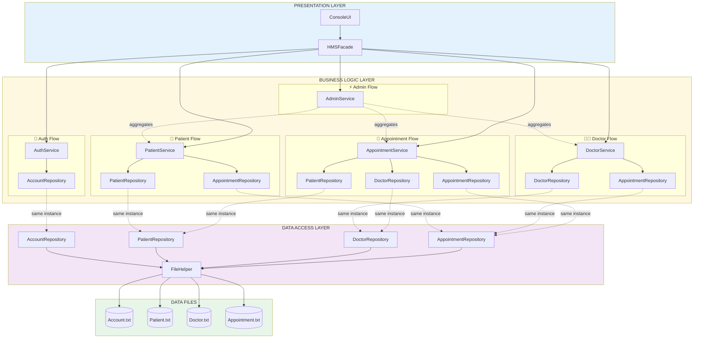
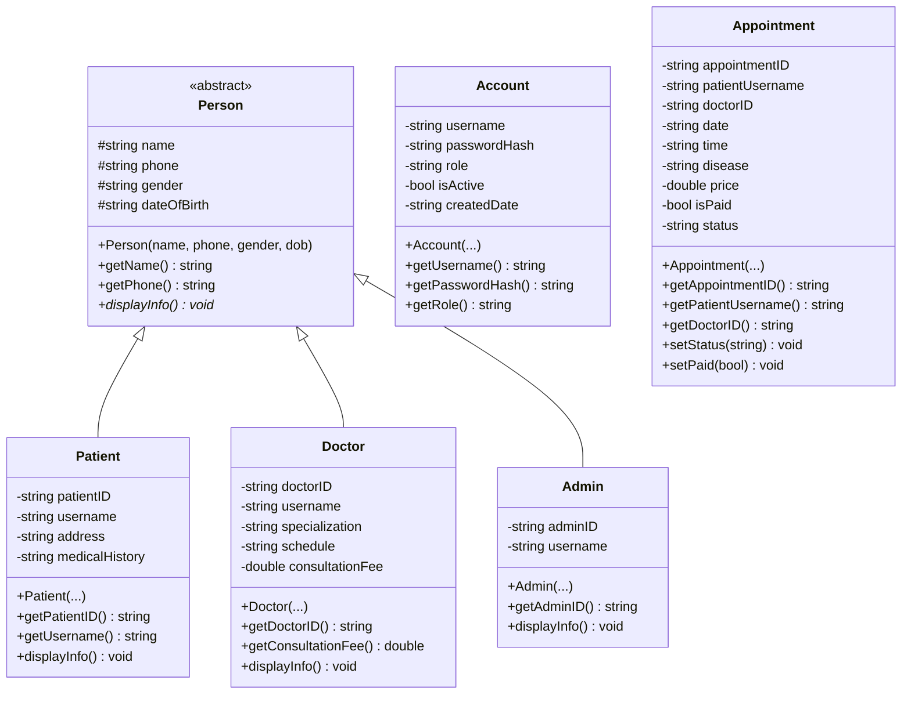
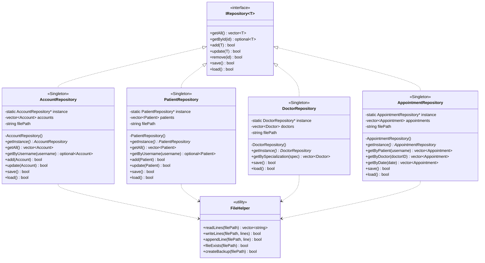
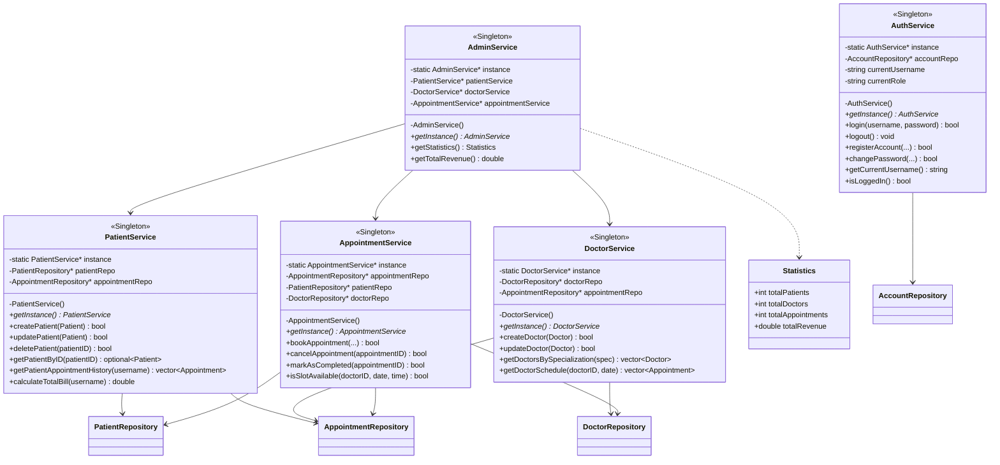
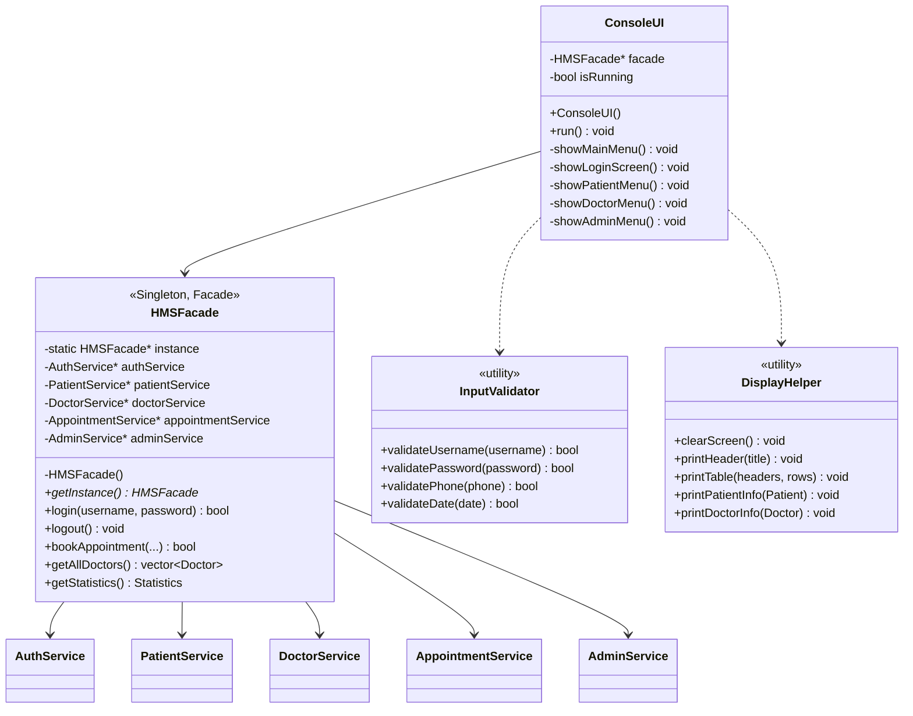

# Sơ Đồ Kiến Trúc Chi Tiết

> **Mục đích:** Hiểu đầy đủ relationships, dependencies, và class structure
> **Đối tượng:** Developers implementing code, architecture review

---

## 🔍 Sơ Đồ Dependencies Chi Tiết



---

## 📋 Bảng Dependencies Chi Tiết

### Services → Repositories

| Service | Uses Repositories | Lý Do |
|---------|------------------|-------|
| **AuthService** | • AccountRepository | Login/logout<br>Quản lý account |
| **PatientService** | • PatientRepository<br>• AppointmentRepository | CRUD patients<br>Xem lịch hẹn của patient |
| **DoctorService** | • DoctorRepository<br>• AppointmentRepository | CRUD doctors<br>Xem lịch làm việc của doctor |
| **AppointmentService** | • AppointmentRepository<br>• PatientRepository<br>• DoctorRepository | CRUD appointments<br>Validate patient exists<br>Get doctor's consultation fee |
| **AdminService** | • PatientService<br>• DoctorService<br>• AppointmentService | Tổng hợp thống kê<br>Không trực tiếp dùng Repos |

### Repositories → Files

| Repository | File | Operations |
|-----------|------|-----------|
| AccountRepository | Account.txt | Read/Write accounts |
| PatientRepository | Patient.txt | Read/Write patients |
| DoctorRepository | Doctor.txt | Read/Write doctors |
| AppointmentRepository | Appointment.txt | Read/Write appointments |

**Tất cả repositories đều sử dụng FileHelper cho I/O operations.**

---

## 🏗️ Class Diagram Đầy Đủ

### Model Layer (Entities)



### Data Access Layer



### Business Logic Layer



### Presentation Layer



---

## 🔄 Use Case: Book Appointment

### Flow Chi Tiết

```
1. User input → ConsoleUI.showPatientMenu()
   ↓
2. ConsoleUI → facade->bookAppointment(doctorID, date, time, disease)
   ↓
3. Facade → appointmentService->bookAppointment(...)
   ↓
4. AppointmentService:
   4.1. Validate patient → patientRepo->getByUsername(currentUsername)
   4.2. Validate doctor → doctorRepo->getById(doctorID)
   4.3. Get fee → doctor.getConsultationFee()
   4.4. Check slot → isSlotAvailable(doctorID, date, time)
   4.5. Create appointment → appointmentRepo->add(appointment)
   4.6. Save to file → appointmentRepo->save()
   ↓
5. Facade → return success/failure
   ↓
6. ConsoleUI → DisplayHelper.printSuccess("Đặt lịch thành công!")
```

---

## 📊 Method Responsibilities

### AppointmentService Methods

| Method | Uses Repositories | Purpose |
|--------|------------------|---------|
| `bookAppointment()` | PatientRepo, DoctorRepo, AppointmentRepo | Validate và tạo appointment mới |
| `isSlotAvailable()` | AppointmentRepo | Check xem time slot còn trống không |
| `cancelAppointment()` | AppointmentRepo | Cập nhật status thành "cancelled" |
| `markAsCompleted()` | AppointmentRepo | Cập nhật status thành "completed" |
| `markAsPaid()` | AppointmentRepo | Cập nhật isPaid = true |

### PatientService Methods

| Method | Uses Repositories | Purpose |
|--------|------------------|---------|
| `createPatient()` | PatientRepo | Thêm patient mới |
| `getPatientAppointmentHistory()` | AppointmentRepo | Lấy tất cả appointments của patient |
| `getPatientUpcomingAppointments()` | AppointmentRepo | Lấy appointments chưa hoàn thành |
| `calculateTotalBill()` | AppointmentRepo | Tính tổng tiền các appointments |

### DoctorService Methods

| Method | Uses Repositories | Purpose |
|--------|------------------|---------|
| `createDoctor()` | DoctorRepo | Thêm doctor mới |
| `getDoctorSchedule()` | AppointmentRepo | Lấy lịch làm việc của doctor |
| `getDoctorsBySpecialization()` | DoctorRepo | Tìm doctors theo chuyên khoa |

---

## 🎯 Singleton Pattern Implementation

### Tại Sao Dùng Singleton?

✅ **Repositories:** Đảm bảo chỉ 1 instance truy cập file, tránh conflict khi ghi
✅ **Services:** Đảm bảo state nhất quán (VD: AuthService.currentUsername)
✅ **HMSFacade:** Điểm truy cập duy nhất cho UI

### Template Code

```cpp
class AccountRepository {
private:
    static AccountRepository* instance;
    AccountRepository() = default;  // Private constructor

public:
    // Delete copy & assignment
    AccountRepository(const AccountRepository&) = delete;
    AccountRepository& operator=(const AccountRepository&) = delete;

    static AccountRepository* getInstance() {
        if (instance == nullptr) {
            instance = new AccountRepository();
        }
        return instance;
    }
};

// Khởi tạo static member
AccountRepository* AccountRepository::instance = nullptr;
```

---

## 📚 Đọc Thêm

- **Overview đơn giản:** Xem [architecture-overview.md](architecture-overview.md)
- **Full documentation:** Xem [../ARCHITECTURE_vi.md](../ARCHITECTURE_vi.md)
- **Build guide:** Xem [../BUILD_vi.md](../BUILD_vi.md)

---

**💡 TIP:** Dùng sơ đồ này khi implement code để biết service nào cần repository nào!