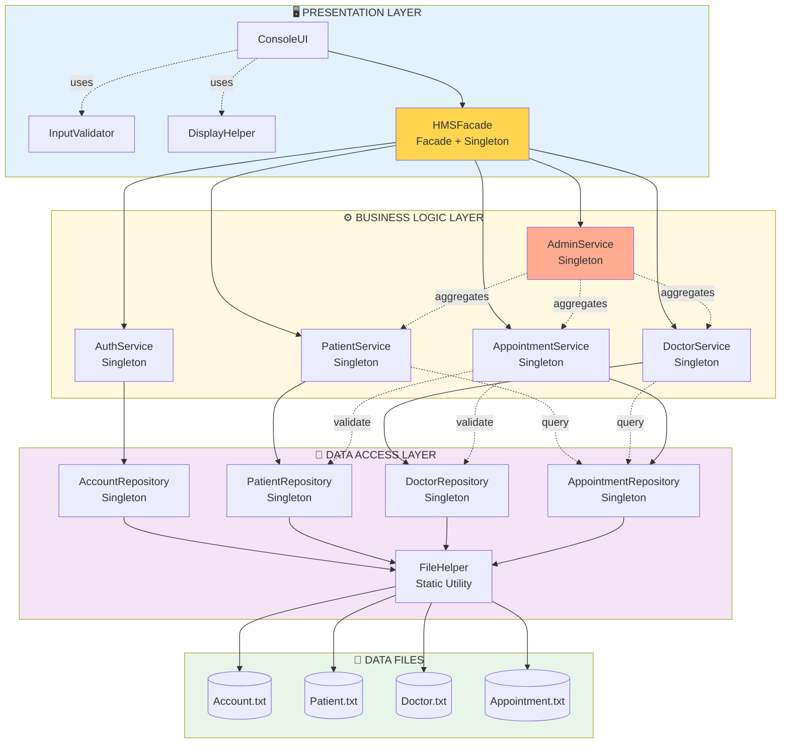

# Sơ Đồ Kiến Trúc Tổng Quan

> **Mục đích:** Hiểu nhanh luồng dữ liệu và cấu trúc 3 tầng
> **Đối tượng:** Tất cả thành viên team, giới thiệu project, README.md

---

## 🎯 Sơ Đồ Mermaid (Dành cho GitHub/README.md)



---

## 📊 Giải Thích Các Tầng

### 🖥️ PRESENTATION LAYER (Tầng Giao Diện)

**Trách nhiệm:** Tương tác với người dùng

| Component | Vai trò |
|-----------|---------|
| **ConsoleUI** | Hiển thị menu, nhận input từ user, điều khiển luồng ứng dụng |
| **HMSFacade** | Điểm truy cập duy nhất (Facade + Singleton), che giấu độ phức tạp của BLL |
| **InputValidator** | Validate input (username, password, phone, date, time, ID formats) |
| **DisplayHelper** | Format output (tables, colors, headers, messages, entity display) |

**Luồng:** User → ConsoleUI → Facade → Services

---

### ⚙️ BUSINESS LOGIC LAYER (Tầng Logic Nghiệp Vụ)

**Trách nhiệm:** Xử lý business rules, validation, orchestration

| Service | Vai trò |
|---------|---------|
| **AuthService** | Login, logout, register, change password, authorization checks |
| **PatientService** | CRUD patients, appointment history, billing calculation |
| **DoctorService** | CRUD doctors, schedule management, activity tracking |
| **AppointmentService** | Booking, cancellation, status management, slot availability |
| **AdminService** | Statistics aggregation, reports generation, system health |

**Đặc điểm:** Tất cả đều là **Singleton** với thread-safe `std::mutex`

---

### 💾 DATA ACCESS LAYER (Tầng Truy Cập Dữ Liệu)

**Trách nhiệm:** Lưu trữ và truy xuất dữ liệu từ file

| Repository | File tương ứng | Key Features |
|-----------|---------------|--------------|
| **AccountRepository** | Account.txt | Role filtering, credential validation |
| **PatientRepository** | Patient.txt | Search by name/phone/keyword |
| **DoctorRepository** | Doctor.txt | Filter by specialization |
| **AppointmentRepository** | Appointment.txt | Rich queries (by patient/doctor/date/status) |
| **FileHelper** | All files | Static utility for I/O, backup/restore |

**Đặc điểm:**
- Tất cả repositories đều là **Singleton** với thread-safe `std::mutex`
- Implement **IRepository<T>** interface với CRUD + `count()`, `exists()`, `clear()`
- Auto-generate IDs với `getNextId()`

---

### 📁 DATA FILES

```
data/
├── Account.txt        # username|passwordHash|role|isActive|createdDate
├── Patient.txt        # patientID|username|name|phone|gender|dob|address|history
├── Doctor.txt         # doctorID|username|name|phone|gender|dob|spec|schedule|fee
└── Appointment.txt    # appointmentID|patientUsername|doctorID|date|time|disease|price|isPaid|status|notes
```

---

## 🔄 Luồng Dữ Liệu (Data Flow)

### INPUT (User → System)

```
User input
    ↓
ConsoleUI (hiển thị menu, nhận input)
    ↓
InputValidator (validate format)
    ↓
HMSFacade (điều phối, check authorization)
    ↓
Service (business logic, validation)
    ↓
Repository (CRUD operations)
    ↓
FileHelper (serialize, write file)
    ↓
Data File (.txt)
```

### OUTPUT (System → User)

```
Data File (.txt)
    ↓
FileHelper (read, parse lines)
    ↓
Repository (deserialize → entities)
    ↓
Service (filter, calculate, aggregate)
    ↓
HMSFacade (format response)
    ↓
DisplayHelper (format tables, messages)
    ↓
ConsoleUI (display to user)
    ↓
User sees output
```

---

## 🎯 Dependencies Chính

### AppointmentService Dependencies

```
AppointmentService
├── AppointmentRepository (CRUD appointments)
├── PatientRepository (validate patient exists)
└── DoctorRepository (validate doctor, get consultation fee)
```

**Lý do:** Khi book appointment, cần:
1. Check patient tồn tại (PatientRepo)
2. Check doctor tồn tại và lấy fee (DoctorRepo)
3. Check slot availability (AppointmentRepo)
4. Lưu appointment (AppointmentRepo)

### PatientService Dependencies

```
PatientService
├── PatientRepository (CRUD patients)
└── AppointmentRepository (get patient's appointments, calculate bills)
```

**Lý do:** Patient cần xem lịch hẹn và tính tiền

### DoctorService Dependencies

```
DoctorService
├── DoctorRepository (CRUD doctors)
└── AppointmentRepository (get doctor's schedule, activity tracking)
```

**Lý do:** Doctor cần xem lịch làm việc và thống kê

### AdminService Dependencies

```
AdminService
├── PatientService (get patient stats)
├── DoctorService (get doctor stats)
└── AppointmentService (get appointment stats, revenue)
```

**Lý do:** Admin aggregate data từ các services (không trực tiếp dùng Repos)

---

## 📐 Design Patterns

| Pattern | Áp dụng | Mục đích |
|---------|---------|----------|
| **Singleton** | Repositories, Services, HMSFacade | Đảm bảo 1 instance duy nhất, thread-safe với mutex |
| **Facade** | HMSFacade | Đơn giản hóa interface cho UI |
| **Repository** | IRepository<T> | Abstraction cho data access |
| **Factory Method** | `deserialize()` static methods | Parse string → Entity |

---

## 💡 Nguyên Tắc SOLID

| Nguyên tắc | Áp dụng |
|-----------|---------|
| **S**RP | Entities chứa data + serialize, Services chứa logic, Repos chứa I/O |
| **O**CP | IRepository cho phép thêm data sources mới |
| **L**SP | Patient/Doctor/Admin thay thế Person |
| **I**SP | Services có methods cụ thể, không phải god class |
| **D**IP | Services phụ thuộc Repository interfaces |

---

## 🔑 Key Types (from common/Types.h)

### Enums
- **Role**: `PATIENT`, `DOCTOR`, `ADMIN`, `UNKNOWN`
- **AppointmentStatus**: `SCHEDULED`, `COMPLETED`, `CANCELLED`, `NO_SHOW`, `UNKNOWN`
- **Gender**: `MALE`, `FEMALE`, `OTHER`, `UNKNOWN`

### Type Aliases
- `Result<T>` = `std::optional<T>` (for deserialize results)
- `List<T>` = `std::vector<T>`
- `ID`, `Username`, `PasswordHash`, `Date`, `Time`, `Phone` = `std::string`
- `Money` = `double`

---

## 🚀 Ưu Điểm Của Kiến Trúc Này

✅ **Separation of Concerns:** Mỗi tầng có trách nhiệm riêng
✅ **Testability:** Dễ test từng tầng riêng biệt
✅ **Maintainability:** Dễ sửa và mở rộng
✅ **Reusability:** Services có thể dùng cho nhiều UI khác nhau
✅ **Scalability:** Dễ thêm features mới (Department, Medicine...)
✅ **Thread Safety:** Mutex protection cho Singleton instances

---

## 📚 Đọc Thêm

- **Chi tiết hơn:** Xem [architecture-detailed.md](architecture-detailed.md)
- **Implementation:** Xem [../ARCHITECTURE.md](../ARCHITECTURE.md)
- **Build guide:** Xem [../BUILD.md](../BUILD.md)

---
