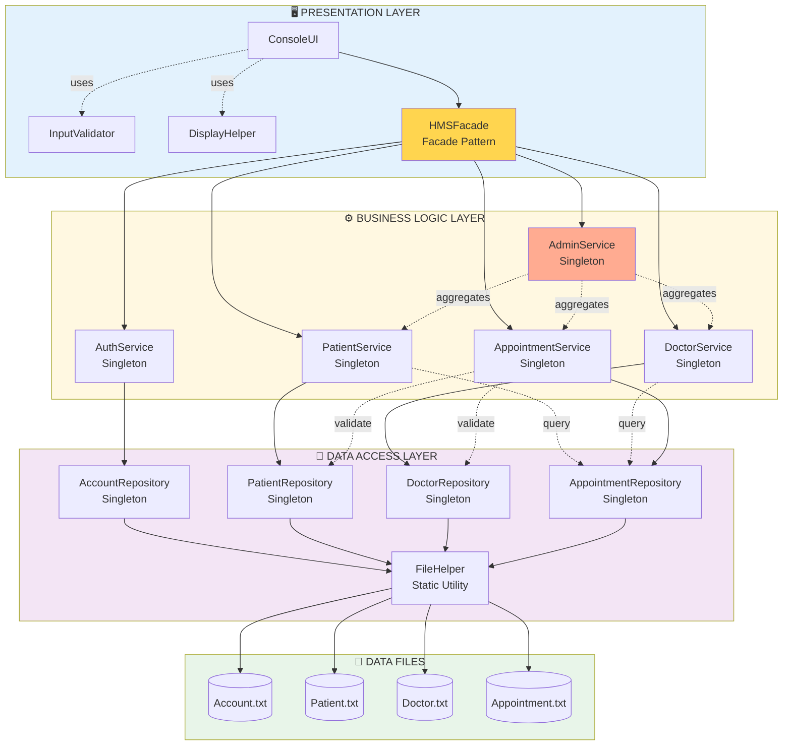

# Sơ Đồ Kiến Trúc Tổng Quan

> **Mục đích:** Hiểu nhanh luồng dữ liệu và cấu trúc 3 tầng
> **Đối tượng:** Tất cả thành viên team, giới thiệu project, README.md

---

## 🎯 Sơ Đồ Mermaid (Dành cho GitHub/README.md)



---

## 📊 Giải Thích Các Tầng

### 🖥️ PRESENTATION LAYER (Tầng Giao Diện)

**Trách nhiệm:** Tương tác với người dùng

| Component | Vai trò |
|-----------|---------|
| **ConsoleUI** | Hiển thị menu, nhận input từ user |
| **HMSFacade** | Điểm truy cập duy nhất, che giấu độ phức tạp của BLL |
| **InputValidator** | Validate input (username, password, phone...) |
| **DisplayHelper** | Format output (tables, colors, pagination) |

**Luồng:** User → ConsoleUI → Facade

---

### ⚙️ BUSINESS LOGIC LAYER (Tầng Logic Nghiệp Vụ)

**Trách nhiệm:** Xử lý business rules, validation, orchestration

| Service | Vai trò |
|---------|---------|
| **AuthService** | Login, logout, change password |
| **PatientService** | CRUD patients, view appointments, calculate bills |
| **DoctorService** | CRUD doctors, manage schedule |
| **AppointmentService** | Book, cancel, check slots |
| **AdminService** | Statistics, reports (aggregate data) |

**Đặc điểm:** Tất cả đều là **Singleton** (1 instance duy nhất)

---

### 💾 DATA ACCESS LAYER (Tầng Truy Cập Dữ Liệu)

**Trách nhiệm:** Lưu trữ và truy xuất dữ liệu từ file

| Repository | File tương ứng |
|-----------|---------------|
| **AccountRepository** | Account.txt |
| **PatientRepository** | Patient.txt |
| **DoctorRepository** | Doctor.txt |
| **AppointmentRepository** | Appointment.txt |
| **FileHelper** | Utility cho I/O operations |

**Đặc điểm:** Tất cả đều là **Singleton**, dùng **IRepository<T>** interface

---

### 📁 DATA FILES

```
data/
├── Account.txt        # username|passwordHash|role|isActive|createdDate
├── Patient.txt        # patientID|username|name|phone|gender|dob|address|history
├── Doctor.txt         # doctorID|username|name|phone|gender|dob|spec|schedule|fee
└── Appointment.txt    # appointmentID|patientUsername|doctorID|date|time|disease|...
```

---

## 🔄 Luồng Dữ Liệu (Data Flow)

### INPUT (User → System)

```
User input
    ↓
ConsoleUI (hiển thị menu, nhận input)
    ↓
HMSFacade (điều phối)
    ↓
Service (business logic, validation)
    ↓
Repository (CRUD operations)
    ↓
FileHelper (read/write file)
    ↓
Data File (.txt)
```

### OUTPUT (System → User)

```
Data File (.txt)
    ↓
FileHelper (parse data)
    ↓
Repository (trả về entities)
    ↓
Service (tính toán, aggregate)
    ↓
HMSFacade (format response)
    ↓
ConsoleUI (display to user)
    ↓
User sees output
```

---

## 🎯 Dependencies Chính

### AppointmentService Dependencies

```
AppointmentService
├── AppointmentRepository (CRUD appointments)
├── PatientRepository (validate patient exists)
└── DoctorRepository (get consultation fee)
```

**Lý do:** Khi book appointment, cần:
1. Check patient tồn tại (PatientRepo)
2. Check doctor tồn tại và lấy fee (DoctorRepo)
3. Lưu appointment (AppointmentRepo)

### PatientService Dependencies

```
PatientService
├── PatientRepository (CRUD patients)
└── AppointmentRepository (get patient's appointments)
```

**Lý do:** Patient cần xem lịch hẹn của mình

### DoctorService Dependencies

```
DoctorService
├── DoctorRepository (CRUD doctors)
└── AppointmentRepository (get doctor's schedule)
```

**Lý do:** Doctor cần xem lịch làm việc

### AdminService Dependencies

```
AdminService
├── PatientService (get patient stats)
├── DoctorService (get doctor stats)
└── AppointmentService (get appointment stats)
```

**Lý do:** Admin aggregate data từ các services

---

## 📐 Design Patterns

| Pattern | Áp dụng | Mục đích |
|---------|---------|----------|
| **Singleton** | Repositories, Services | Đảm bảo 1 instance duy nhất |
| **Facade** | HMSFacade | Đơn giản hóa interface cho UI |
| **Repository** | IRepository<T> | Abstraction cho data access |

---

## 💡 Nguyên Tắc SOLID

| Nguyên tắc | Áp dụng |
|-----------|---------|
| **S**RP | Entities chỉ chứa data, Services chứa logic, Repos chứa I/O |
| **O**CP | IRepository cho phép thêm data sources mới |
| **L**SP | Patient/Doctor/Admin thay thế Person |
| **I**SP | Services có methods cụ thể, không phải god class |
| **D**IP | Services phụ thuộc Repository interfaces |

---

## 🚀 Ưu Điểm Của Kiến Trúc Này

✅ **Separation of Concerns:** Mỗi tầng có trách nhiệm riêng
✅ **Testability:** Dễ test từng tầng riêng biệt
✅ **Maintainability:** Dễ sửa và mở rộng
✅ **Reusability:** Services có thể dùng cho nhiều UI khác nhau
✅ **Scalability:** Dễ thêm features mới (Department, Medicine...)

---

## 📚 Đọc Thêm

- **Chi tiết hơn:** Xem [architecture-detailed.md](architecture-detailed.md)
- **Implementation:** Xem [../ARCHITECTURE_vi.md](../ARCHITECTURE_vi.md)
- **Build guide:** Xem [../BUILD_vi.md](../BUILD_vi.md)

---

**💡 TIP:** Dùng sơ đồ này trong README.md để giới thiệu project!